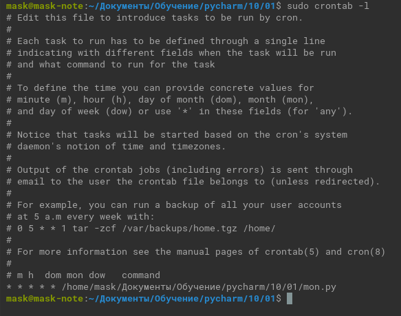
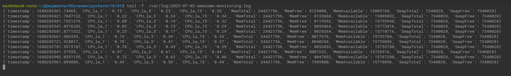

# Домашнее задание к занятию 13 «Введение в мониторинг»

## Обязательные задания

1. Вас пригласили настроить мониторинг на проект. На онбординге вам рассказали, что проект представляет из себя платформу для вычислений с выдачей текстовых отчётов, которые сохраняются на диск. 
Взаимодействие с платформой осуществляется по протоколу http. Также вам отметили, что вычисления загружают ЦПУ. Какой минимальный набор метрик вы выведите в мониторинг и почему?
   
   - CPU load average - средние значения загрузки процессора за 1, 5, и 15 минут. Для понимания нагрузки на CPU.
   - Количество свободной оперативной памяти.
   - Свободное место на диске. Чтобы предотвратить переполнение.
   - Количество свободных индексных дескрипторов. Чтобы контролировать возможность создания нового файла.
   - Состояние сетевого интерфейса (Link, Загруженность). Нет сети - недоступно приложение.   
   - Статус сервиса web-сервера. Не работает web-сервер - недоступен сайт.
   - Коды ответа web-сервера.
     Сбор всех кодов ответа для статистики и алертинга при превышении допустимых пороговых значений ошибок.
   - Соотношение количества ошибок определенного кода к общему потоку запросов к web-серверу.
     Корректность работы web-сервера.
   - Количество запросов в секунду.  
     Для статистки и алертинга при резких скачках (в разы превышающие значения стандартной нагрузки)  

2. Менеджер продукта, посмотрев на ваши метрики, сказал, что ему непонятно, что такое RAM/inodes/CPUla. Также он сказал, что хочет понимать, насколько мы выполняем свои обязанности перед клиентами и какое качество обслуживания. Что вы можете ему предложить?
   
   - CPUla - средние значения загрузки процессора за 1, 5, и 15 минут.
     Значение не должно превышать n, где n - количество ядер.  
   - inodes - индексные дескрипторы файловой системы.
     Имеют ограниченное количество почти во всех файловых системах.
     Количество свободных не должно быть, к примеру, меньше 10% от общего количества.
   - RAM - Оперативная память.
     Количество свободной не должно превышать 85% от доступного объёма. 
   
    Предоставить соглашение об уровне обслуживания (SLA). Если не хватает каких-либо метрик добавить.
    Рассчитать индикатор качества обслуживания (SLI), исходя из полученных данных.

3. Вашей DevOps-команде в этом году не выделили финансирование на построение системы сбора логов. Разработчики, в свою очередь, хотят видеть все ошибки, которые выдают их приложения. Какое решение вы можете предпринять в этой ситуации, чтобы разработчики получали ошибки приложения?
   
   Без наличия ресурсов скрипт (bash/python) или Sentry.
   При наличии ресурсов rsyslog, syslog-ng, Clickhouse,Vector,LightHouse или ELK - стек.
   Зависит от того в каком виде нужны логи.

3. Вы, как опытный SRE, сделали мониторинг, куда вывели отображения выполнения SLA = 99% по http-кодам ответов. 
Этот параметр вычисляется по формуле: summ_2xx_requests/summ_all_requests. Он не поднимается выше 70%, но при этом в вашей системе нет кодов ответа 5xx и 4xx. Где у вас ошибка?
  
   Ошибка в формуле. 3xx - ответы не являются ошибкой.
   Должно быть так: `(summ_2xx_requests+summ_3xx_requests)/summ_all_requests`

## Дополнительное задание* (со звёздочкой) 

Выполнение этого задания необязательно и никак не влияет на получение зачёта по домашней работе.

_____

Вы устроились на работу в стартап. На данный момент у вас нет возможности развернуть полноценную систему 
мониторинга, и вы решили самостоятельно написать простой python3-скрипт для сбора основных метрик сервера. 

Вы, как опытный системный администратор, знаете, что системная информация сервера лежит в директории `/proc`. Также знаете, что в системе Linux есть  планировщик задач cron, который может запускать задачи по расписанию.

Суммировав всё, вы спроектировали приложение, которое:

- является python3-скриптом;
- собирает метрики из папки `/proc`;
- складывает метрики в файл 'YY-MM-DD-awesome-monitoring.log' в директорию /var/log 
(YY — год, MM — месяц, DD — день);
- каждый сбор метрик складывается в виде json-строки, в виде:
  + timestamp — временная метка, int, unixtimestamp;
  + metric_1 — метрика 1;
  + metric_2 — метрика 2;
  
     ...
     
  + metric_N — метрика N.
  
- сбор метрик происходит каждую минуту по cron-расписанию.

Для успешного выполнения задания нужно привести:

* работающий [код](mon.py) python3-скрипта;
* конфигурацию cron-расписания;

  
* пример верно сформированного 'YY-MM-DD-awesome-monitoring.log', имеющий не меньше пяти записей.

  

Дополнительная информация:

1. Количество собираемых метрик должно быть не меньше четырёх.
1. По желанию можно не ограничивать себя только сбором метрик из `/proc`.

---

### Как оформить решение задания

Выполненное домашнее задание пришлите в виде ссылки на .md-файл в вашем репозитории.

---
