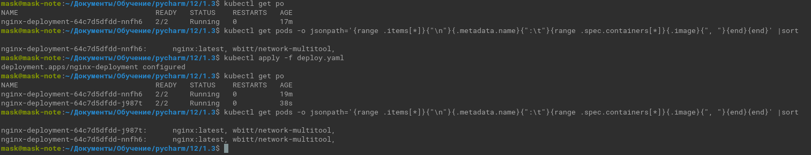
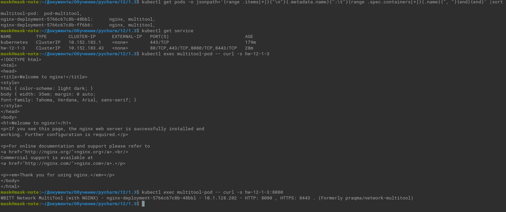
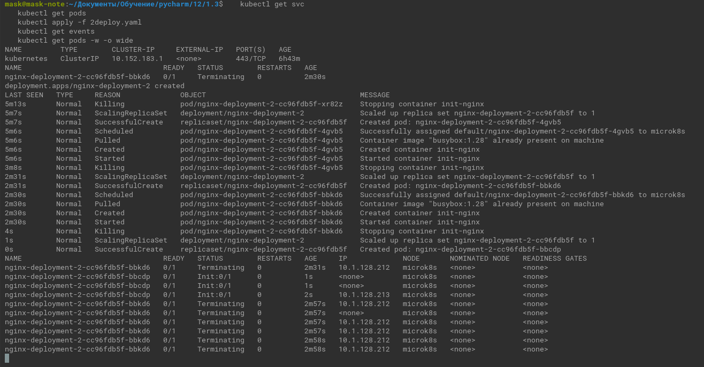
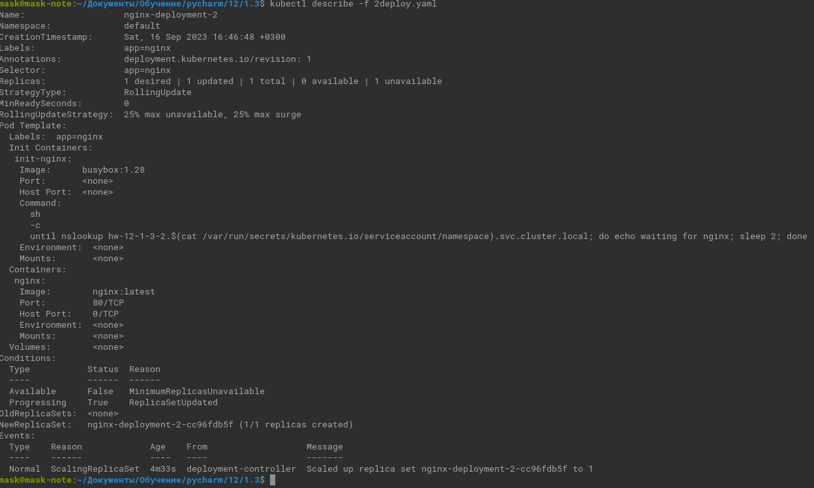
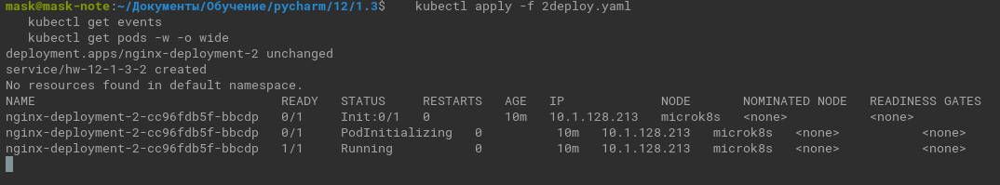

# Домашнее задание к занятию «Запуск приложений в K8S»

### Цель задания

В тестовой среде для работы с Kubernetes, установленной в предыдущем ДЗ, необходимо развернуть Deployment с приложением, состоящим из нескольких контейнеров, и масштабировать его.

------

### Чеклист готовности к домашнему заданию

1. Установленное k8s-решение (например, MicroK8S).
2. Установленный локальный kubectl.
3. Редактор YAML-файлов с подключённым git-репозиторием.

------

### Инструменты и дополнительные материалы, которые пригодятся для выполнения задания

1. [Описание](https://kubernetes.io/docs/concepts/workloads/controllers/deployment/) Deployment и примеры манифестов.
2. [Описание](https://kubernetes.io/docs/concepts/workloads/pods/init-containers/) Init-контейнеров.
3. [Описание](https://github.com/wbitt/Network-MultiTool) Multitool.

------

### Задание 1. Создать [Deployment](deploy.yaml)  и обеспечить доступ к репликам приложения из другого Pod

1. Создать Deployment приложения, состоящего из двух контейнеров — nginx и multitool. Решить возникшую ошибку.
2. После запуска увеличить количество реплик работающего приложения до 2.
3. Продемонстрировать количество подов до и после масштабирования.

   

4. Создать Service, который обеспечит доступ до реплик приложений из п.1.
5. Создать отдельный Pod с приложением multitool и убедиться с помощью `curl`, что из пода есть доступ до приложений из п.1.
   
   

------

### Задание 2. Создать [Deployment](2deploy.yaml) и обеспечить старт основного контейнера при выполнении условий

1. Создать Deployment приложения nginx и обеспечить старт контейнера только после того, как будет запущен сервис этого приложения.
2. Убедиться, что nginx не стартует. В качестве Init-контейнера взять busybox.
   
   
   
   <details><summary></summary>
   
   ``` commandline
   kubectl get svc
   kubectl get pods
   kubectl apply -f 2deploy.yaml
   kubectl get events   
   kubectl get pods -w -o wide
   ```
   ```commandline
   kubectl describe -f 2deploy.yaml 
   ```
   </details>
   
   
3. Создать и запустить Service. Убедиться, что Init запустился.
   
      <details><summary></summary>
   
   ``` commandline
   kubectl apply -f 2deploy.yaml
   kubectl get events   
   kubectl get pods -w -o wide
   ```

   </details>

   

   <details><summary>   
   kubectl describe -f 2deploy.yaml
   </summary>
   
   ```commandline
   Name:                   nginx-deployment-2
   Namespace:              default
   CreationTimestamp:      Sat, 16 Sep 2023 16:46:48 +0300
   Labels:                 app=nginx
   Annotations:            deployment.kubernetes.io/revision: 1
   Selector:               app=nginx
   Replicas:               1 desired | 1 updated | 1 total | 1 available | 0 unavailable
   StrategyType:           RollingUpdate
   MinReadySeconds:        0
   RollingUpdateStrategy:  25% max unavailable, 25% max surge
   Pod Template:
     Labels:  app=nginx
     Init Containers:
      init-nginx:
       Image:      busybox:1.28
       Port:       <none>
       Host Port:  <none>
       Command:
         sh
         -c
         until nslookup hw-12-1-3-2.$(cat /var/run/secrets/kubernetes.io/serviceaccount/namespace).svc.cluster.local; do echo waiting for nginx; sleep 2; done
       Environment:  <none>
       Mounts:       <none>
     Containers:
      nginx:
       Image:        nginx:latest
       Port:         80/TCP
       Host Port:    0/TCP
       Environment:  <none>
       Mounts:       <none>
     Volumes:        <none>
   Conditions:
     Type           Status  Reason
     ----           ------  ------
     Available      True    MinimumReplicasAvailable
     Progressing    True    NewReplicaSetAvailable
   OldReplicaSets:  <none>
   NewReplicaSet:   nginx-deployment-2-cc96fdb5f (1/1 replicas created)
   Events:          <none>
   
   
   Name:              hw-12-1-3-2
   Namespace:         default
   Labels:            <none>
   Annotations:       <none>
   Selector:          app=nginx
   Type:              ClusterIP
   IP Family Policy:  SingleStack
   IP Families:       IPv4
   IP:                10.152.183.182
   IPs:               10.152.183.182
   Port:              svc-nginx-http  80/TCP
   TargetPort:        nginx-http/TCP
   Endpoints:         10.1.128.213:80
   Session Affinity:  None
   Events:            <none>
   ```
   </details>

4. Продемонстрировать состояние пода до и после запуска сервиса.

   Смотри &#8593;&uArr;&#8593;

------

### Правила приема работы

1. Домашняя работа оформляется в своем Git-репозитории в файле README.md. Выполненное домашнее задание пришлите ссылкой на .md-файл в вашем репозитории.
2. Файл README.md должен содержать скриншоты вывода необходимых команд `kubectl` и скриншоты результатов.
3. Репозиторий должен содержать файлы манифестов и ссылки на них в файле README.md.

------
