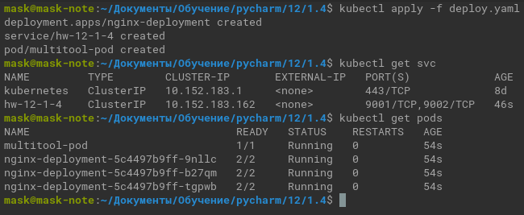
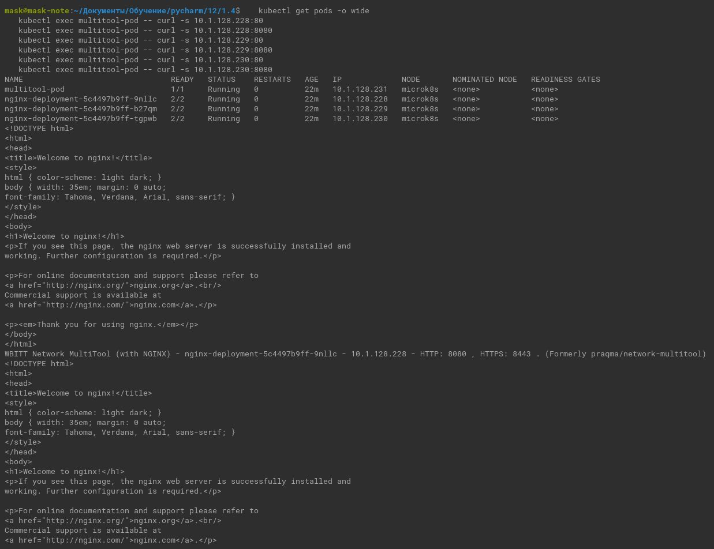
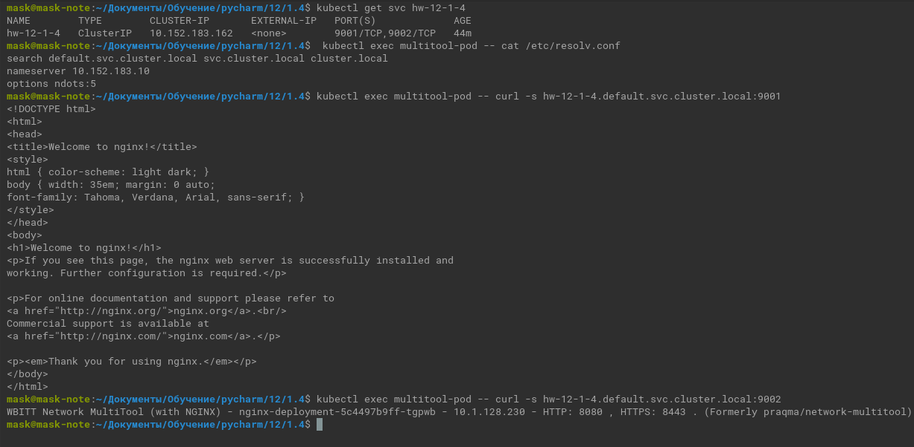
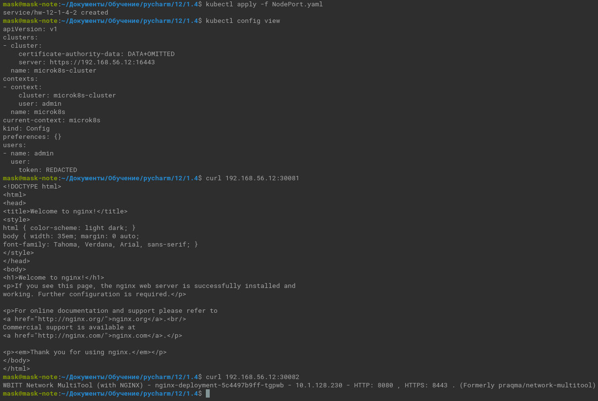

# Домашнее задание к занятию «Сетевое взаимодействие в K8S. Часть 1»

### Цель задания

В тестовой среде Kubernetes необходимо обеспечить доступ к приложению, установленному в предыдущем ДЗ и состоящему из двух контейнеров, по разным портам в разные контейнеры как внутри кластера, так и снаружи.

------

### Чеклист готовности к домашнему заданию

1. Установленное k8s-решение (например, MicroK8S).
2. Установленный локальный kubectl.
3. Редактор YAML-файлов с подключённым Git-репозиторием.

------

### Инструменты и дополнительные материалы, которые пригодятся для выполнения задания

1. [Описание](https://kubernetes.io/docs/concepts/workloads/controllers/deployment/) Deployment и примеры манифестов.
2. [Описание](https://kubernetes.io/docs/concepts/services-networking/service/) Описание Service.
3. [Описание](https://github.com/wbitt/Network-MultiTool) Multitool.

------

### Задание 1. Создать [Deployment](deploy.yaml) и обеспечить доступ к контейнерам приложения по разным портам из другого Pod внутри кластера

1. Создать Deployment приложения, состоящего из двух контейнеров (nginx и multitool), с количеством реплик 3 шт.
2. Создать Service, который обеспечит доступ внутри кластера до контейнеров приложения из п.1 по порту 9001 — nginx 80, по 9002 — multitool 8080.
3. Создать отдельный Pod с приложением multitool и убедиться с помощью `curl`, что из пода есть доступ до приложения из п.1 по разным портам в разные контейнеры.
4. Продемонстрировать доступ с помощью `curl` по доменному имени сервиса.
5. Предоставить манифесты Deployment и Service в решении, а также скриншоты или вывод команды п.4.

   <details>
   <summary></summary>
   
   ```commandline
      kubectl apply -f deploy.yaml
      kubectl get svc
      kubectl get pods
   ``` 

   </details>

   

   <details>
   <summary>kubectl describe -f deploy.yaml</summary>

    ```commandline
    
          Name:                   nginx-deployment
    Namespace:              default
    CreationTimestamp:      Sun, 24 Sep 2023 12:19:36 +0300
    Labels:                 app=nginx
    Annotations:            deployment.kubernetes.io/revision: 1
    Selector:               app=nginx
    Replicas:               3 desired | 3 updated | 3 total | 3 available | 0 unavailable
    StrategyType:           RollingUpdate
    MinReadySeconds:        0
    RollingUpdateStrategy:  25% max unavailable, 25% max surge
    Pod Template:
      Labels:  app=nginx
      Containers:
       nginx:
        Image:        nginx:latest
        Port:         80/TCP
        Host Port:    0/TCP
        Environment:  <none>
        Mounts:       <none>
       multitool:
        Image:      wbitt/network-multitool
        Port:       8080/TCP
        Host Port:  0/TCP
        Environment:
          HTTP_PORT:   8080
          HTTPS_PORT:  8443
        Mounts:        <none>
      Volumes:         <none>
    Conditions:
      Type           Status  Reason
      ----           ------  ------
      Available      True    MinimumReplicasAvailable
      Progressing    True    NewReplicaSetAvailable
    OldReplicaSets:  <none>
    NewReplicaSet:   nginx-deployment-5c4497b9ff (3/3 replicas created)
    Events:
      Type    Reason             Age    From                   Message
      ----    ------             ----   ----                   -------
      Normal  ScalingReplicaSet  4m24s  deployment-controller  Scaled up replica set nginx-deployment-5c4497b9ff to 3
    
    
    Name:              hw-12-1-4
    Namespace:         default
    Labels:            <none>
    Annotations:       <none>
    Selector:          app=nginx
    Type:              ClusterIP
    IP Family Policy:  SingleStack
    IP Families:       IPv4
    IP:                10.152.183.162
    IPs:               10.152.183.162
    Port:              svc-nginx-http  9001/TCP
    TargetPort:        nginx-http/TCP
    Endpoints:         10.1.128.228:80,10.1.128.229:80,10.1.128.230:80
    Port:              svc-mtool-http  9002/TCP
    TargetPort:        mtool-http/TCP
    Endpoints:         10.1.128.228:8080,10.1.128.229:8080,10.1.128.230:8080
    Session Affinity:  None
    Events:            <none>
    
    
    Name:             multitool-pod
    Namespace:        default
    Priority:         0
    Service Account:  default
    Node:             microk8s/10.0.2.15
    Start Time:       Sun, 24 Sep 2023 12:19:36 +0300
    Labels:           <none>
    Annotations:      cni.projectcalico.org/containerID: 7aa79c064a23e5bd93bec5b5a9ee8f3be1f57cced4c91ae91ff128f402b5b604
                      cni.projectcalico.org/podIP: 10.1.128.231/32
                      cni.projectcalico.org/podIPs: 10.1.128.231/32
    Status:           Running
    IP:               10.1.128.231
    IPs:
      IP:  10.1.128.231
    Containers:
      pod-multitool:
        Container ID:   containerd://49a2f075541cf6a4aeabbed3c553d16618e081abeaba38d0ea586d3ddf410833
        Image:          wbitt/network-multitool
        Image ID:       docker.io/wbitt/network-multitool@sha256:d1137e87af76ee15cd0b3d4c7e2fcd111ffbd510ccd0af076fc98dddfc50a735
        Port:           <none>
        Host Port:      <none>
        State:          Running
          Started:      Sun, 24 Sep 2023 12:19:42 +0300
        Ready:          True
        Restart Count:  0
        Environment:    <none>
        Mounts:
          /var/run/secrets/kubernetes.io/serviceaccount from kube-api-access-h2fh6 (ro)
    Conditions:
      Type              Status
      Initialized       True 
      Ready             True 
      ContainersReady   True 
      PodScheduled      True 
    Volumes:
      kube-api-access-h2fh6:
        Type:                    Projected (a volume that contains injected data from multiple sources)
        TokenExpirationSeconds:  3607
        ConfigMapName:           kube-root-ca.crt
        ConfigMapOptional:       <nil>
        DownwardAPI:             true
    QoS Class:                   BestEffort
    Node-Selectors:              <none>
    Tolerations:                 node.kubernetes.io/not-ready:NoExecute op=Exists for 300s
                                 node.kubernetes.io/unreachable:NoExecute op=Exists for 300s
    Events:
      Type    Reason     Age    From               Message
      ----    ------     ----   ----               -------
      Normal  Scheduled  4m24s  default-scheduler  Successfully assigned default/multitool-pod to microk8s
      Normal  Pulling    4m23s  kubelet            Pulling image "wbitt/network-multitool"
      Normal  Pulled     4m18s  kubelet            Successfully pulled image "wbitt/network-multitool" in 1.109853103s (4.370414343s including waiting)
      Normal  Created    4m18s  kubelet            Created container pod-multitool
      Normal  Started    4m18s  kubelet            Started container pod-multitool
    
    
    ```

   </details>

   ```commandline
   kubectl get pods -o wide
   kubectl exec multitool-pod -- curl -s 10.1.128.228:80
   kubectl exec multitool-pod -- curl -s 10.1.128.228:8080
   kubectl exec multitool-pod -- curl -s 10.1.128.229:80
   kubectl exec multitool-pod -- curl -s 10.1.128.229:8080
   kubectl exec multitool-pod -- curl -s 10.1.128.230:80
   kubectl exec multitool-pod -- curl -s 10.1.128.230:8080
   ```
   
   <details>
   <summary>Вывод</summary>
   
   

   ```commandline
   NAME                                READY   STATUS    RESTARTS   AGE   IP             NODE       NOMINATED NODE   READINESS GATES
   multitool-pod                       1/1     Running   0          50m   10.1.128.231   microk8s   <none>           <none>
   nginx-deployment-5c4497b9ff-9nllc   2/2     Running   0          50m   10.1.128.228   microk8s   <none>           <none>
   nginx-deployment-5c4497b9ff-b27qm   2/2     Running   0          50m   10.1.128.229   microk8s   <none>           <none>
   nginx-deployment-5c4497b9ff-tgpwb   2/2     Running   0          50m   10.1.128.230   microk8s   <none>           <none>
   <!DOCTYPE html>
   <html>
   <head>
   <title>Welcome to nginx!</title>
   <style>
   html { color-scheme: light dark; }
   body { width: 35em; margin: 0 auto;
   font-family: Tahoma, Verdana, Arial, sans-serif; }
   </style>
   </head>
   <body>
   <h1>Welcome to nginx!</h1>
   <p>If you see this page, the nginx web server is successfully installed and
   working. Further configuration is required.</p>
   
   <p>For online documentation and support please refer to
   <a href="http://nginx.org/">nginx.org</a>.<br/>
   Commercial support is available at
   <a href="http://nginx.com/">nginx.com</a>.</p>
   
   <p><em>Thank you for using nginx.</em></p>
   </body>
   </html>
   WBITT Network MultiTool (with NGINX) - nginx-deployment-5c4497b9ff-9nllc - 10.1.128.228 - HTTP: 8080 , HTTPS: 8443 . (Formerly praqma/network-multitool)
   <!DOCTYPE html>
   <html>
   <head>
   <title>Welcome to nginx!</title>
   <style>
   html { color-scheme: light dark; }
   body { width: 35em; margin: 0 auto;
   font-family: Tahoma, Verdana, Arial, sans-serif; }
   </style>
   </head>
   <body>
   <h1>Welcome to nginx!</h1>
   <p>If you see this page, the nginx web server is successfully installed and
   working. Further configuration is required.</p>
   
   <p>For online documentation and support please refer to
   <a href="http://nginx.org/">nginx.org</a>.<br/>
   Commercial support is available at
   <a href="http://nginx.com/">nginx.com</a>.</p>
   
   <p><em>Thank you for using nginx.</em></p>
   </body>
   </html>
   WBITT Network MultiTool (with NGINX) - nginx-deployment-5c4497b9ff-b27qm - 10.1.128.229 - HTTP: 8080 , HTTPS: 8443 . (Formerly praqma/network-multitool)
   <!DOCTYPE html>
   <html>
   <head>
   <title>Welcome to nginx!</title>
   <style>
   html { color-scheme: light dark; }
   body { width: 35em; margin: 0 auto;
   font-family: Tahoma, Verdana, Arial, sans-serif; }
   </style>
   </head>
   <body>
   <h1>Welcome to nginx!</h1>
   <p>If you see this page, the nginx web server is successfully installed and
   working. Further configuration is required.</p>
   
   <p>For online documentation and support please refer to
   <a href="http://nginx.org/">nginx.org</a>.<br/>
   Commercial support is available at
   <a href="http://nginx.com/">nginx.com</a>.</p>
   
   <p><em>Thank you for using nginx.</em></p>
   </body>
   </html>
   WBITT Network MultiTool (with NGINX) - nginx-deployment-5c4497b9ff-tgpwb - 10.1.128.230 - HTTP: 8080 , HTTPS: 8443 . (Formerly praqma/network-multitool)
   ```

   </details>
   <details>
   <summary>DNS</summary>
   
   ```commandline
   kubectl get svc hw-12-1-4
   kubectl exec multitool-pod -- cat /etc/resolv.conf
   kubectl exec multitool-pod -- curl -s hw-12-1-4.default.svc.cluster.local:9001
   kubectl exec multitool-pod -- curl -s hw-12-1-4.default.svc.cluster.local:9002
   ```
   </details>

   

------

### Задание 2. Создать Service и обеспечить доступ к приложениям снаружи кластера

1. Создать отдельный [Service](NodePort.yaml) приложения из Задания 1 с возможностью доступа снаружи кластера к nginx, используя тип NodePort.
2. Продемонстрировать доступ с помощью браузера или `curl` с локального компьютера.
3. Предоставить манифест и Service в решении, а также скриншоты или вывод команды п.2.

   <details>
   <summary></summary>

   ```commandline
   kubectl apply -f NodePort.yaml
   kubectl config view 
   curl 192.168.56.12:30081
   curl 192.168.56.12:30082
   ```
   </details>   
   
   
   
------

### Правила приёма работы

1. Домашняя работа оформляется в своем Git-репозитории в файле README.md. Выполненное домашнее задание пришлите ссылкой на .md-файл в вашем репозитории.
2. Файл README.md должен содержать скриншоты вывода необходимых команд `kubectl` и скриншоты результатов.
3. Репозиторий должен содержать тексты манифестов или ссылки на них в файле README.md.

