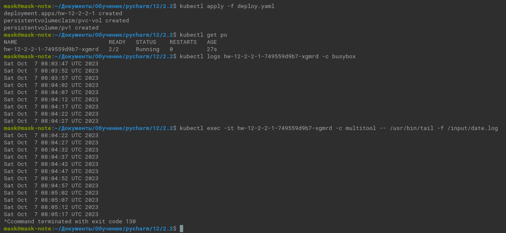
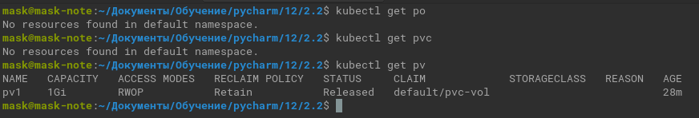
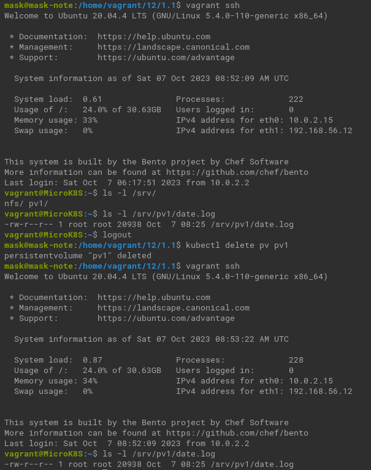
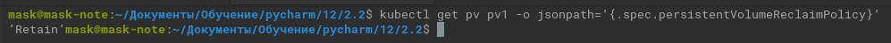
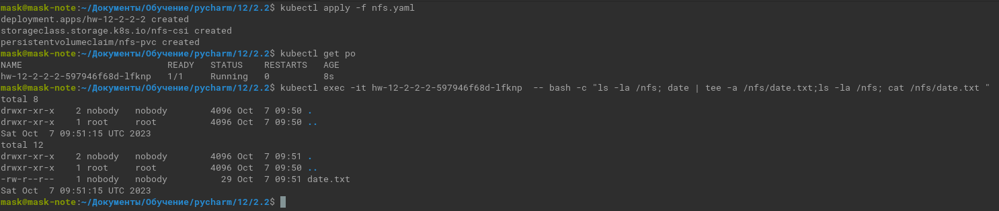

# Домашнее задание к занятию «Хранение в K8s. Часть 2»

### Цель задания

В тестовой среде Kubernetes нужно создать PV и продемострировать запись и хранение файлов.

------

### Чеклист готовности к домашнему заданию

1. Установленное K8s-решение (например, MicroK8S).
2. Установленный локальный kubectl.
3. Редактор YAML-файлов с подключенным GitHub-репозиторием.

------

### Дополнительные материалы для выполнения задания

1. [Инструкция по установке NFS в MicroK8S](https://microk8s.io/docs/nfs). 
2. [Описание Persistent Volumes](https://kubernetes.io/docs/concepts/storage/persistent-volumes/). 
3. [Описание динамического провижининга](https://kubernetes.io/docs/concepts/storage/dynamic-provisioning/). 
4. [Описание Multitool](https://github.com/wbitt/Network-MultiTool).

------

### Задание 1

**Что нужно сделать**

Создать Deployment приложения, использующего локальный PV, созданный вручную.

1. Создать [Deployment](deploy.yaml) приложения, состоящего из контейнеров busybox и multitool.
2. Создать [PV](deploy.yaml)  и [PVC](deploy.yaml)  для подключения папки на локальной ноде, которая будет использована в поде.
3. Продемонстрировать, что multitool может читать файл, в который busybox пишет каждые пять секунд в общей директории.
    <details><summary></summary>
    
    ```commandline
    kubectl apply -f deploy.yaml
    kubectl get po
    kubectl logs hw-12-2-2-1-749559d9b7-xgmrd -c busybox
    kubectl exec -it hw-12-2-2-1-749559d9b7-xgmrd -c multitool -- /usr/bin/tail -f /input/date.log
    ```
    
    </details>

   

4. Удалить Deployment и PVC. Продемонстрировать, что после этого произошло с PV. Пояснить, почему.
    <details><summary></summary>
    
    ```commandline
    kubectl delete deployments.apps hw-12-2-2-1
    kubectl delete persistentvolumeclaims pvc-vol 
    kubectl get po
    kubectl get pvc
    kubectl get pv
    ```
    
    </details>

   

   Volume остался. PersistentVolume - это самостоятельный объект K8s кластера.

5. Продемонстрировать, что файл сохранился на локальном диске ноды.
   Удалить PV.
   Продемонстрировать что произошло с файлом после удаления PV.

    
      
   Пояснить, почему.

   

   Retain — после удаления PV ресурсы из внешних провайдеров автоматически не удаляются.

   <details><summary></summary>
 
   ```commandline
   kubectl get pv pv1 -o jsonpath=’{.spec.persistentVolumeReclaimPolicy}’ 
   ```
 
   </details>

6. Предоставить манифесты, а также скриншоты или вывод необходимых команд.


------

### Задание 2

**Что нужно сделать**

Создать Deployment приложения, которое может хранить файлы на NFS с динамическим созданием PV.

1. Включить и настроить NFS-сервер на MicroK8S.
2. Создать [Deployment](nfs.yaml) приложения состоящего из multitool, и подключить к нему PV, созданный автоматически на сервере NFS.
3. Продемонстрировать возможность чтения и записи файла изнутри пода. 
4. Предоставить манифесты, а также скриншоты или вывод необходимых команд.

   <details><summary></summary>
 
   ```commandline
   kubectl apply -f nfs.yaml 
   kubectl get po
   kubectl exec -it hw-12-2-2-2-597946f68d-lfknp  -- bash -c "ls -la /nfs; date | tee -a /nfs/date.txt;ls -la /nfs; cat /nfs/date.txt "
   ```
 
   </details>

      


------

### Правила приёма работы

1. Домашняя работа оформляется в своём Git-репозитории в файле README.md. Выполненное задание пришлите ссылкой на .md-файл в вашем репозитории.
2. Файл README.md должен содержать скриншоты вывода необходимых команд `kubectl`, а также скриншоты результатов.
3. Репозиторий должен содержать тексты манифестов или ссылки на них в файле README.md.
