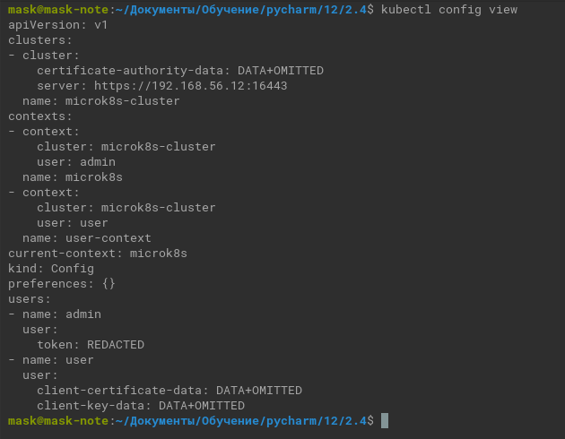
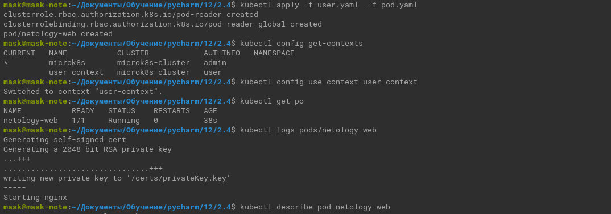
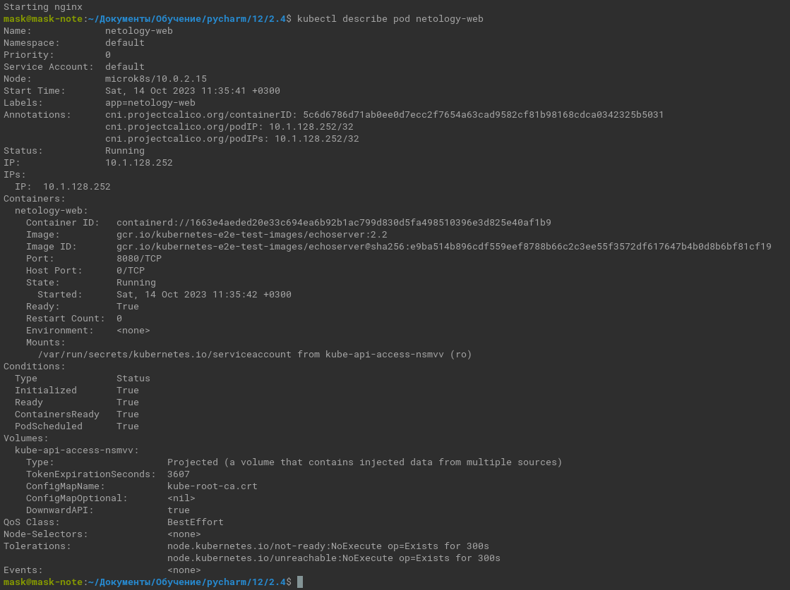
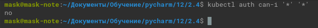

# Домашнее задание к занятию «Управление доступом»

### Цель задания

В тестовой среде Kubernetes нужно предоставить ограниченный доступ пользователю.

------

### Чеклист готовности к домашнему заданию

1. Установлено k8s-решение, например MicroK8S.
2. Установленный локальный kubectl.
3. Редактор YAML-файлов с подключённым github-репозиторием.

------

### Инструменты / дополнительные материалы, которые пригодятся для выполнения задания

1. [Описание](https://kubernetes.io/docs/reference/access-authn-authz/rbac/) RBAC.
2. [Пользователи и авторизация RBAC в Kubernetes](https://habr.com/ru/company/flant/blog/470503/).
3. [RBAC with Kubernetes in Minikube](https://medium.com/@HoussemDellai/rbac-with-kubernetes-in-minikube-4deed658ea7b).

------

### Задание 1. Создайте конфигурацию для подключения пользователя

1. Создайте и подпишите SSL-сертификат для подключения к кластеру.
   <details><summary></summary>
   
   ```commandline
   # Enable RBAC addon
   sudo microk8s enable rbac
   # Create key for user
   openssl genrsa -out user.key 2048
   # Create certificate signing request.
   # In "-subj" you need to map username in "CN" and group in "O" to provide this information in Role Binding section.
   openssl req -new -key user.key -out user.csr -subj "/CN=user/O=netology"
   # Create user certificate   
   openssl x509 -req -in user.csr -CA /var/snap/microk8s/current/certs/ca.crt -CAkey /var/snap/microk8s/current/certs/ca.key -out user.crt -days 100
   ```
   
   </details>
2. Настройте конфигурационный файл kubectl для подключения.
   <details><summary></summary>
   
   ```commandline
   # Set user credentials for kubernetes cluster
   kubectl config set-credentials user --client-certificate=user.crt --client-key=user.key --embed-certs=true
   # Set context for access kubernetes cluster
   kubectl config set-context user-context --cluster=microk8s-cluster --user=user
   ```
   </details>
   
   
3. Создайте роли и все необходимые [настройки](user.yaml) для пользователя.
4. Предусмотрите права пользователя. Пользователь может просматривать логи подов и их конфигурацию (`kubectl logs pod <pod_id>`, `kubectl describe pod <pod_id>`).
5. Предоставьте манифесты и скриншоты и/или вывод необходимых команд.
   
   <details><summary></summary>
   
   ```commandline
   kubectl apply -f user.yaml  -f pod.yaml
   kubectl config get-contexts
   kubectl config use-context user-context
   kubectl get po
   kubectl logs pods/netology-web
   kubectl describe pod netology-web
   kubectl auth can-i '*' '*'
   ```
    
   </details>
   
   
   
   
------

### Правила приёма работы

1. Домашняя работа оформляется в своём Git-репозитории в файле README.md. Выполненное домашнее задание пришлите ссылкой на .md-файл в вашем репозитории.
2. Файл README.md должен содержать скриншоты вывода необходимых команд `kubectl`, скриншоты результатов.
3. Репозиторий должен содержать тексты манифестов или ссылки на них в файле README.md.

------


