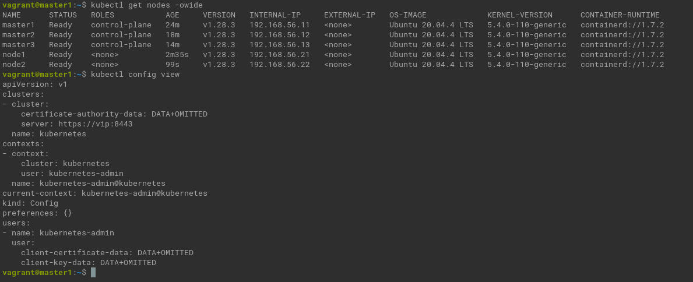

# Домашнее задание к занятию «Установка Kubernetes»

### Цель задания

Установить кластер K8s.

### Чеклист готовности к домашнему заданию

1. Развёрнутые ВМ с ОС Ubuntu 20.04-lts.


### Инструменты и дополнительные материалы, которые пригодятся для выполнения задания

1. [Инструкция по установке kubeadm](https://kubernetes.io/docs/setup/production-environment/tools/kubeadm/create-cluster-kubeadm/).
2. [Документация kubespray](https://kubespray.io/).

-----

### Задание 1. Установить кластер k8s с 1 master node

1. Подготовка работы кластера из 5 нод: 1 мастер и 4 рабочие ноды.
2. В качестве CRI — containerd.
3. Запуск etcd производить на мастере.
4. Способ установки выбрать самостоятельно.


## Дополнительные задания (со звёздочкой)

**Настоятельно рекомендуем выполнять все задания под звёздочкой.** Их выполнение поможет глубже разобраться в материале.   
Задания под звёздочкой необязательные к выполнению и не повлияют на получение зачёта по этому домашнему заданию. 

------
### Задание 2*. Установить HA кластер

1. Установить кластер в режиме HA.
2. Использовать нечётное количество Master-node.
3. Для cluster ip использовать keepalived или другой способ.



### Правила приёма работы

1. Домашняя работа оформляется в своем Git-репозитории в файле README.md. Выполненное домашнее задание пришлите ссылкой на .md-файл в вашем репозитории.
2. Файл README.md должен содержать скриншоты вывода необходимых команд `kubectl get nodes`, а также скриншоты результатов.
3. Репозиторий должен содержать тексты манифестов или ссылки на них в файле README.md.


<details><summary></summary>

```commandline
kubeadm init --apiserver-advertise-address=192.168.56.11 --pod-network-cidr 10.244.0.0/16
mkdir -p $HOME/.kube
sudo cp -i /etc/kubernetes/admin.conf $HOME/.kube/config
sudo chown $(id -u):$(id -g) $HOME/.kube/config
source <(kubectl completion bash)
echo "source <(kubectl completion bash)" >> ~/.bashrc
   
kubeadm join 192.168.56.11:6443 --token or044b.68bvsr3kkdjcgts5 --discovery-token-ca-cert-hash sha256:0689ef2c0415e1755699f490241550b618da850ce67ff0d96e7f78bf6f2404f4 
sudo kubectl apply -f https://raw.githubusercontent.com/coreos/flannel/master/Documentation/kube-flannel.yml
# cluster
sudo kubeadm init --apiserver-advertise-address=192.168.56.11 --pod-network-cidr 10.244.0.0/16 --control-plane-endpoint=vip:8443 --apiserver-cert-extra-sans=192.168.56.10
cp /vagrant/pki/ca.* ./
cp /vagrant/pki/sa.* ./
cp /vagrant/pki/front-proxy-ca.* ./
cp /vagrant/pki/etcd/ca.* ./etcd/

kubeadm join vip:8443 --token 0b13pd.g578dutwwum6xtbl --discovery-token-ca-cert-hash sha256:bcc1dec06cc95e1a5e2ee456e97b00a2c1d52b7622355859f608ab9b7e7bbb5b --control-plane --apiserver-advertise-address=192.168.56.13
kubeadm join vip:8443 --token 0b13pd.g578dutwwum6xtbl --discovery-token-ca-cert-hash sha256:bcc1dec06cc95e1a5e2ee456e97b00a2c1d52b7622355859f608ab9b7e7bbb5b --control-plane --apiserver-advertise-address=192.168.56.13
kubeadm join vip:8443 --token 0b13pd.g578dutwwum6xtbl --discovery-token-ca-cert-hash sha256:bcc1dec06cc95e1a5e2ee456e97b00a2c1d52b7622355859f608ab9b7e7bbb5b  --apiserver-advertise-address=192.168.56.21
kubeadm join vip:8443 --token 0b13pd.g578dutwwum6xtbl --discovery-token-ca-cert-hash sha256:bcc1dec06cc95e1a5e2ee456e97b00a2c1d52b7622355859f608ab9b7e7bbb5b  --apiserver-advertise-address=192.168.56.22    
```
</details>