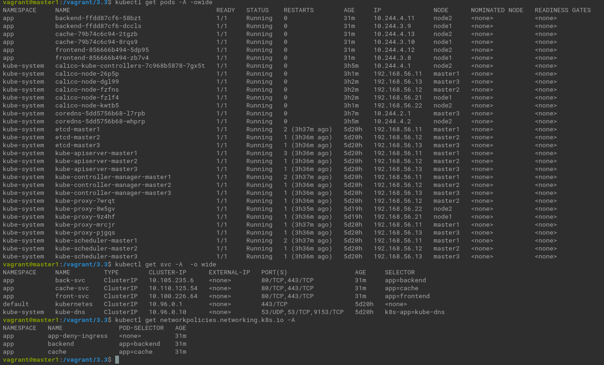
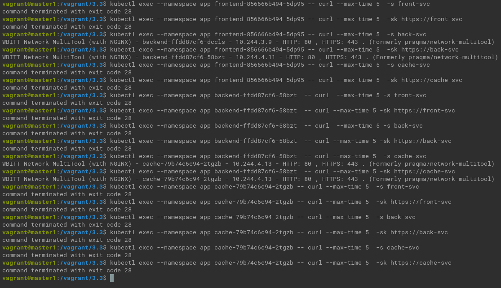

# Домашнее задание к занятию «Как работает сеть в K8s»

### Цель задания

Настроить сетевую политику доступа к подам.

### Чеклист готовности к домашнему заданию

1. Кластер K8s с установленным сетевым плагином Calico.

### Инструменты и дополнительные материалы, которые пригодятся для выполнения задания

1. [Документация Calico](https://www.tigera.io/project-calico/).
2. [Network Policy](https://kubernetes.io/docs/concepts/services-networking/network-policies/).
3. [About Network Policy](https://docs.projectcalico.org/about/about-network-policy).

-----

### Задание 1. Создать сетевую политику или несколько политик для обеспечения доступа

1. Создать deployment'ы приложений [frontend](front.yaml), [backend](back.yaml) и [cache](cache.yaml) и соответсвующие сервисы.
2. В качестве образа использовать network-multitool.
3. Разместить поды в namespace App.
4. Создать [политики](np.yaml), чтобы обеспечить доступ frontend -> backend -> cache. Другие виды подключений должны быть запрещены.
5. Продемонстрировать, что трафик разрешён и запрещён.




### Правила приёма работы

1. Домашняя работа оформляется в своём Git-репозитории в файле README.md. Выполненное домашнее задание пришлите ссылкой на .md-файл в вашем репозитории.
2. Файл README.md должен содержать скриншоты вывода необходимых команд, а также скриншоты результатов.
3. Репозиторий должен содержать тексты манифестов или ссылки на них в файле README.md.

<details><summary></summary>

```commandline
kubectl create namespace app
kubectl apply -f front.yaml -f back.yaml -f cache.yaml -f np.yaml
kubectl get pods -A -owide
kubectl get svc -A  -o wide
kubectl get networkpolicies.networking.k8s.io -A

kubectl exec --namespace app frontend-856666b494-5dp95 -- curl --max-time 5  -s front-svc
kubectl exec --namespace app frontend-856666b494-5dp95 -- curl --max-time 5  -sk https://front-svc
kubectl exec --namespace app frontend-856666b494-5dp95 -- curl --max-time 5  -s back-svc
kubectl exec --namespace app frontend-856666b494-5dp95 -- curl --max-time 5  -sk https://back-svc
kubectl exec --namespace app frontend-856666b494-5dp95 -- curl --max-time 5  -s cache-svc
kubectl exec --namespace app frontend-856666b494-5dp95 -- curl --max-time 5  -sk https://cache-svc

kubectl exec --namespace app backend-ffdd87cf6-58bzt  -- curl  --max-time 5 -s front-svc
kubectl exec --namespace app backend-ffdd87cf6-58bzt  -- curl --max-time 5 -sk https://front-svc
kubectl exec --namespace app backend-ffdd87cf6-58bzt  -- curl  --max-time 5 -s back-svc
kubectl exec --namespace app backend-ffdd87cf6-58bzt  -- curl --max-time 5 -sk https://back-svc
kubectl exec --namespace app backend-ffdd87cf6-58bzt  -- curl --max-time 5  -s cache-svc
kubectl exec --namespace app backend-ffdd87cf6-58bzt  -- curl --max-time 5 -sk https://cache-svc


kubectl exec --namespace app cache-79b74c6c94-2tgzb -- curl --max-time 5  -s front-svc
kubectl exec --namespace app cache-79b74c6c94-2tgzb -- curl --max-time 5  -sk https://front-svc
kubectl exec --namespace app cache-79b74c6c94-2tgzb -- curl --max-time 5  -s back-svc
kubectl exec --namespace app cache-79b74c6c94-2tgzb -- curl --max-time 5  -sk https://back-svc
kubectl exec --namespace app cache-79b74c6c94-2tgzb -- curl --max-time 5  -s cache-svc
kubectl exec --namespace app cache-79b74c6c94-2tgzb -- curl --max-time 5  -sk https://cache-svc


```
</details>