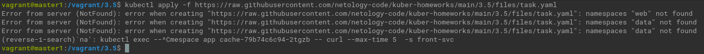
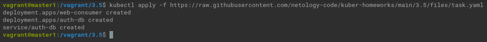
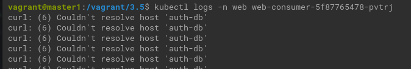
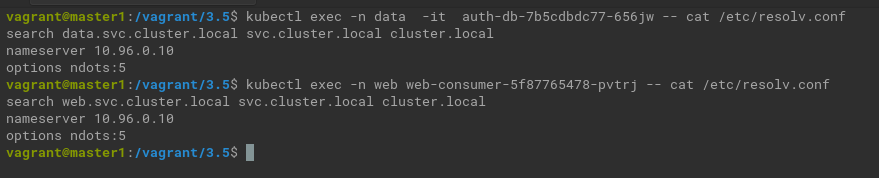
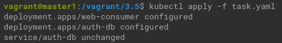
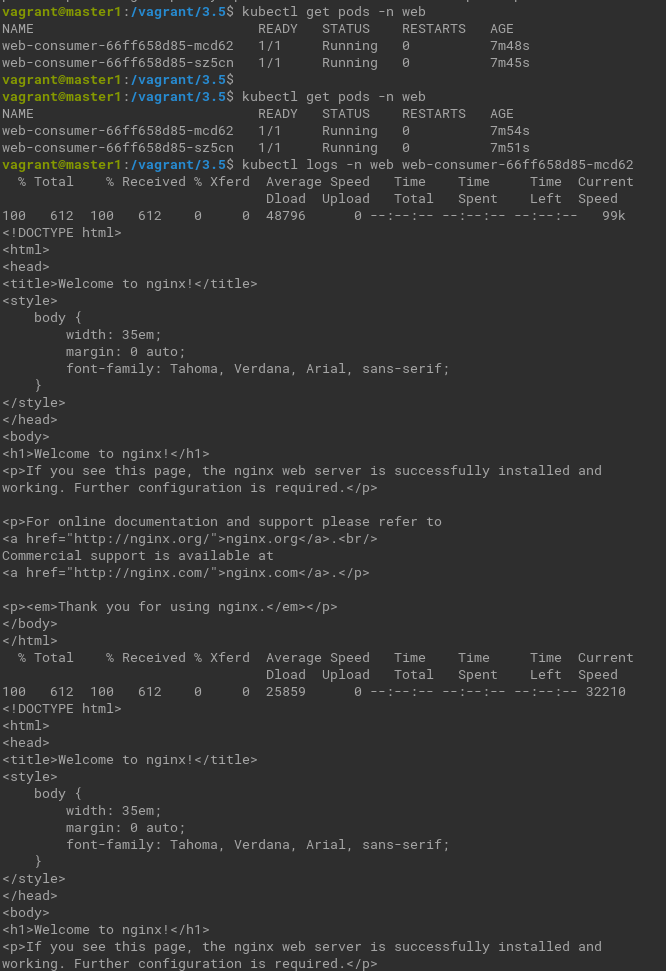

# Домашнее задание к занятию Troubleshooting

### Цель задания

Устранить неисправности при деплое приложения.

### Чеклист готовности к домашнему заданию

1. Кластер K8s.

### Задание. При деплое приложение web-consumer не может подключиться к auth-db. Необходимо это исправить

1. Установить приложение по команде:
```shell
kubectl apply -f https://raw.githubusercontent.com/netology-code/kuber-homeworks/main/3.5/files/task.yaml
```



<details><summary>Создаём требуемые namespace.</summary>

```commandline
kubectl create namespace web
kubectl create namespace data
```

</details>   



2. Выявить проблему и описать.

<details><summary>
Смотрим логи web-consumer
</summary>

```commandline
kubectl logs -n web web-consumer-5f87765478-pvtrj
```
</details> 




Pod не может разыменовать короткое имя сервиса auth-db. 

Это нормально. Сервисы и поды имеют записи следующего формата:
```
service-name.namespace-name.svc.cluster-domain.example
pod-ip-address.namespace-name.pod.cluster-domain.example
```

3. Исправить проблему, описать, что сделано.

<details><summary>Посмотрим настройки dns в подах</summary>

```commandline
 kubectl exec -n web web-consumer-5f87765478-pvtrj -- cat /etc/resolv.conf
kubectl exec -n data  -it  auth-db-7b5cdbdc77-656jw -- cat /etc/resolv.conf
```
</details>



   Есть 2 способа:

 <details><summary>1</summary>

 `while true; do curl auth-db; sleep 5; done` 
 
 заменить на  
 `while true; do curl auth-db.data; sleep 5; done` 
</details>
<details><summary>2</summary>
Или изненить настройки DNS в подах.

```yaml
dnsPolicy: "None"
dnsConfig:
  nameservers:
    - 10.96.0.10
  searches:
    - data.svc.cluster.local
    - web.svc.cluster.local
    - svc.cluster.local
    - cluster.local
  options:
    - name: ndots
      value: "5"
```

</details>


4. Продемонстрировать, что проблема решена.

<details><summary></summary>
 
```kubectl apply -f task.yaml``` 
</details>



<details><summary></summary>

```commandline
kubectl get pods -n web
kubectl logs -n web web-consumer-66ff658d85-mcd62
```
</details>


### Правила приёма работы

1. Домашняя работа оформляется в своём Git-репозитории в файле README.md. Выполненное домашнее задание пришлите ссылкой на .md-файл в вашем репозитории.
2. Файл README.md должен содержать скриншоты вывода необходимых команд, а также скриншоты результатов.
3. Репозиторий должен содержать тексты манифестов или ссылки на них в файле README.md.

