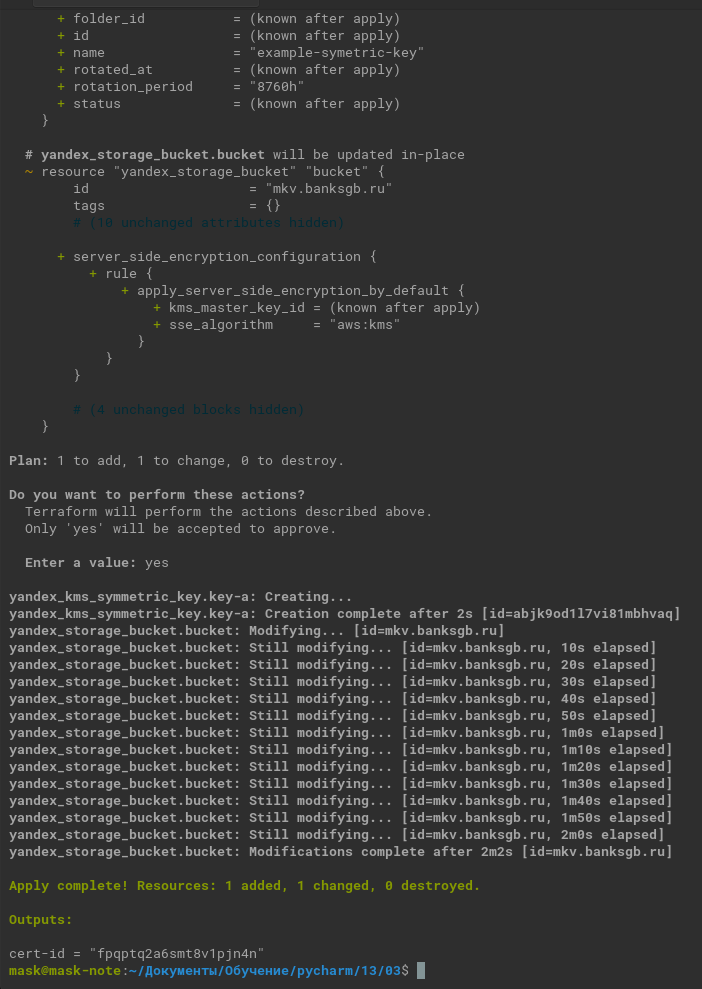
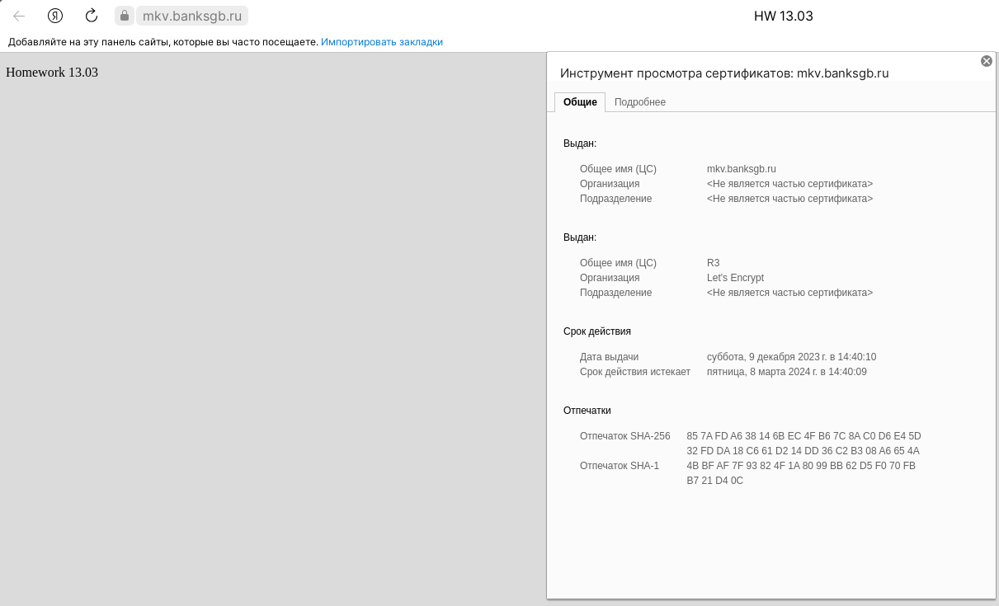

# Домашнее задание к занятию «Безопасность в облачных провайдерах»  

Используя конфигурации, выполненные в рамках предыдущих домашних заданий, нужно добавить возможность шифрования бакета.

---
## Задание 1. Yandex Cloud   

1. С помощью ключа в KMS необходимо зашифровать содержимое бакета:

 - создать ключ в KMS;
 - с помощью ключа зашифровать содержимое бакета, созданного ранее.

<details><summary>

Задание выполнялось после второго.



</summary>

```commandline
Terraform used the selected providers to generate the following execution plan. Resource actions are indicated with the following symbols:
  + create
  ~ update in-place

Terraform will perform the following actions:

  # yandex_kms_symmetric_key.key-a will be created
  + resource "yandex_kms_symmetric_key" "key-a" {
      + created_at          = (known after apply)
      + default_algorithm   = "AES_128"
      + deletion_protection = false
      + description         = "description for key"
      + folder_id           = (known after apply)
      + id                  = (known after apply)
      + name                = "example-symetric-key"
      + rotated_at          = (known after apply)
      + rotation_period     = "8760h"
      + status              = (known after apply)
    }

  # yandex_storage_bucket.bucket will be updated in-place
  ~ resource "yandex_storage_bucket" "bucket" {
        id                    = "mkv.banksgb.ru"
        tags                  = {}
        # (10 unchanged attributes hidden)

      + server_side_encryption_configuration {
          + rule {
              + apply_server_side_encryption_by_default {
                  + kms_master_key_id = (known after apply)
                  + sse_algorithm     = "aws:kms"
                }
            }
        }

        # (4 unchanged blocks hidden)
    }

Plan: 1 to add, 1 to change, 0 to destroy.

Do you want to perform these actions?
  Terraform will perform the actions described above.
  Only 'yes' will be accepted to approve.

  Enter a value: yes

yandex_kms_symmetric_key.key-a: Creating...
yandex_kms_symmetric_key.key-a: Creation complete after 2s [id=abjk9od1l7vi81mbhvaq]
yandex_storage_bucket.bucket: Modifying... [id=mkv.banksgb.ru]
yandex_storage_bucket.bucket: Still modifying... [id=mkv.banksgb.ru, 10s elapsed]
yandex_storage_bucket.bucket: Still modifying... [id=mkv.banksgb.ru, 20s elapsed]
yandex_storage_bucket.bucket: Still modifying... [id=mkv.banksgb.ru, 30s elapsed]
yandex_storage_bucket.bucket: Still modifying... [id=mkv.banksgb.ru, 40s elapsed]
yandex_storage_bucket.bucket: Still modifying... [id=mkv.banksgb.ru, 50s elapsed]
yandex_storage_bucket.bucket: Still modifying... [id=mkv.banksgb.ru, 1m0s elapsed]
yandex_storage_bucket.bucket: Still modifying... [id=mkv.banksgb.ru, 1m10s elapsed]
yandex_storage_bucket.bucket: Still modifying... [id=mkv.banksgb.ru, 1m20s elapsed]
yandex_storage_bucket.bucket: Still modifying... [id=mkv.banksgb.ru, 1m30s elapsed]
yandex_storage_bucket.bucket: Still modifying... [id=mkv.banksgb.ru, 1m40s elapsed]
yandex_storage_bucket.bucket: Still modifying... [id=mkv.banksgb.ru, 1m50s elapsed]
yandex_storage_bucket.bucket: Still modifying... [id=mkv.banksgb.ru, 2m0s elapsed]
yandex_storage_bucket.bucket: Modifications complete after 2m2s [id=mkv.banksgb.ru]

Apply complete! Resources: 1 added, 1 changed, 0 destroyed.

Outputs:

cert-id = "fpqptq2a6smt8v1pjn4n"

```


</details>


2. ~~(Выполняется не в Terraform)*~~ Создать статический [сайт](03/main.tf) в Object Storage c собственным публичным адресом и сделать доступным по HTTPS:

 - создать сертификат;
 - создать статическую страницу в Object Storage и применить сертификат HTTPS;
 - в качестве результата предоставить скриншот на страницу с сертификатом в заголовке (замочек).

   

Полезные документы:

- [Настройка HTTPS статичного сайта](https://cloud.yandex.ru/docs/storage/operations/hosting/certificate).
- [Object Storage bucket](https://registry.terraform.io/providers/yandex-cloud/yandex/latest/docs/resources/storage_bucket).
- [KMS key](https://registry.terraform.io/providers/yandex-cloud/yandex/latest/docs/resources/kms_symmetric_key).

--- 
<details><summary>

## Задание 2*. AWS (задание со звёздочкой)

</summary>

Это необязательное задание. Его выполнение не влияет на получение зачёта по домашней работе.

**Что нужно сделать**

1. С помощью роли IAM записать файлы ЕС2 в S3-бакет:
 - создать роль в IAM для возможности записи в S3 бакет;
 - применить роль к ЕС2-инстансу;
 - с помощью bootstrap-скрипта записать в бакет файл веб-страницы.
2. Организация шифрования содержимого S3-бакета:

 - используя конфигурации, выполненные в домашнем задании из предыдущего занятия, добавить к созданному ранее бакету S3 возможность шифрования Server-Side, используя общий ключ;
 - включить шифрование SSE-S3 бакету S3 для шифрования всех вновь добавляемых объектов в этот бакет.

3. *Создание сертификата SSL и применение его к ALB:

 - создать сертификат с подтверждением по email;
 - сделать запись в Route53 на собственный поддомен, указав адрес LB;
 - применить к HTTPS-запросам на LB созданный ранее сертификат.

Resource Terraform:

- [IAM Role](https://registry.terraform.io/providers/hashicorp/aws/latest/docs/resources/iam_role).
- [AWS KMS](https://registry.terraform.io/providers/hashicorp/aws/latest/docs/resources/kms_key).
- [S3 encrypt with KMS key](https://registry.terraform.io/providers/hashicorp/aws/latest/docs/resources/s3_bucket_object#encrypting-with-kms-key).

Пример bootstrap-скрипта:

```
#!/bin/bash
yum install httpd -y
service httpd start
chkconfig httpd on
cd /var/www/html
echo "<html><h1>My cool web-server</h1></html>" > index.html
aws s3 mb s3://mysuperbacketname2021
aws s3 cp index.html s3://mysuperbacketname2021
```

### Правила приёма работы

Домашняя работа оформляется в своём Git репозитории в файле README.md. Выполненное домашнее задание пришлите ссылкой на .md-файл в вашем репозитории.
Файл README.md должен содержать скриншоты вывода необходимых команд, а также скриншоты результатов.
Репозиторий должен содержать тексты манифестов или ссылки на них в файле README.md.

</details>