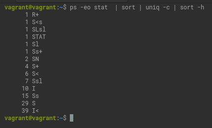

# Домашнее задание к занятию "3.3. Операционные системы. Лекция 1"

### Цель задания

В результате выполнения этого задания вы:

1. Познакомитесь с инструментом strace, который помогает отслеживать системные вызовы процессов, и является необходимым для отладки и расследований в случае возникновения ошибок в работе программ.
2. Рассмотрите различные режимы работы скриптов, настраиваемые командой set. Один и тот же код в скриптах в разных режимах работы ведет себя по-разному.

### Чеклист готовности к домашнему заданию

1. Убедитесь, что у вас установлен инструмент `strace`, выполнив команду `strace -V` для проверки версии. В Ubuntu 20.04 strace установлен, но в других дистрибутивах его может не быть "из коробки". Обратитесь к документации дистрибутива, как установить инструмент strace.
2. Убедитесь, что у вас установлен пакет `bpfcc-tools`, [сведения по установке](https://github.com/iovisor/bcc/blob/master/INSTALL.md)

### Инструменты/ дополнительные материалы, которые пригодятся для выполнения задания

1. Изучите документацию lsof - `man lsof` или та же информация, но в [сети](https://linux.die.net/man/8/lsof)
2. Документация по режимам работы bash находится в `help set` или в [сети](https://www.gnu.org/software/bash/manual/html_node/The-Set-Builtin.html)

------

## Задание

1. Какой системный вызов делает команда `cd`? 

    В прошлом ДЗ мы выяснили, что `cd` не является самостоятельной  программой, это `shell builtin`, поэтому запустить `strace` непосредственно на `cd` не получится. Тем не менее, вы можете запустить `strace` на `/bin/bash -c 'cd /tmp'`. В этом случае вы увидите полный список системных вызовов, которые делает сам `bash` при старте. 

    Вам нужно найти тот единственный, который относится именно к `cd`. Обратите внимание, что `strace` выдаёт результат своей работы в поток stderr, а не в stdout.
    
    
    ```chdir("/tmp") ```
----

2. Попробуйте использовать команду `file` на объекты разных типов в файловой системе. Например:
    ```bash
    vagrant@netology1:~$ file /dev/tty
    /dev/tty: character special (5/0)
    vagrant@netology1:~$ file /dev/sda
    /dev/sda: block special (8/0)
    vagrant@netology1:~$ file /bin/bash
    /bin/bash: ELF 64-bit LSB shared object, x86-64
    ```
    Используя `strace` выясните, где находится база данных `file`, на основании которой она делает свои догадки.
   
   

   ```
   openat(AT_FDCWD, "/etc/magic", O_RDONLY) = 3
   openat(AT_FDCWD, "/usr/share/misc/magic.mgc", O_RDONLY) = 3
   ```
   Это подтверждает документация. Так же говорит о порядке использования файлов.
   ```
   Информация, идентифицирующая эти файлы, считывается из /etc/magic 
   и скомпилированного файла magic /usr/share/misc/magic.mgc
   или файлов в каталоге /usr/share/misc/magic,
   если скомпилированный файл не существует.
   Кроме того, если $HOME/.magic.mgc или $HOME/.magic существуют,
   они будут использоваться вместо системных файлов magic.
   ```   
---

3. Предположим, приложение пишет лог в текстовый файл. Этот файл оказался удален (deleted в lsof), однако возможности сигналом сказать приложению переоткрыть файлы или просто перезапустить приложение – нет. Так как приложение продолжает писать в удаленный файл, место на диске постепенно заканчивается. Основываясь на знаниях о перенаправлении потоков предложите способ обнуления открытого удаленного файла (чтобы освободить место на файловой системе).
   
   
1. Занимают ли зомби-процессы какие-то ресурсы в ОС (CPU, RAM, IO)?
   
   Процесс-зомби не использует никаких системных ресурсов, но сохраняет свою запись (PID) в таблице процессов системы.

1. В iovisor BCC есть утилита `opensnoop`:
    ```bash
    root@vagrant:~# dpkg -L bpfcc-tools | grep sbin/opensnoop
    /usr/sbin/opensnoop-bpfcc
    ```
    На какие файлы вы увидели вызовы группы `open` за первую секунду работы утилиты? Воспользуйтесь пакетом `bpfcc-tools` для Ubuntu 20.04. Дополнительные [сведения по установке](https://github.com/iovisor/bcc/blob/master/INSTALL.md).
    
    

1. Какой системный вызов использует `uname -a`? Приведите цитату из man по этому системному вызову, где описывается альтернативное местоположение в `/proc`, где можно узнать версию ядра и релиз ОС.
   
   
   
   Самая интересная пожалуй ```uname```.

   ```man 2 uname```
   
   
   
1. Чем отличается последовательность команд через `;` и через `&&` в bash? Например:
    ```bash
    root@netology1:~# test -d /tmp/some_dir; echo Hi
    Hi
    root@netology1:~# test -d /tmp/some_dir && echo Hi
    root@netology1:~#
    ```
       
    - `;` - Разделяет команды, выполняющихся по порядку, вне зависимости от результата предыдущей.
    - `&&` - Учитывает код выхода предыдущей команды. Должен быть 0. Иначе выполнение прервется.
   
    Есть ли смысл использовать в bash `&&`, если применить `set -e`?
    Да, если не требуется жесткого исполнения конвейера с `&&` в последовательности команд. 
1. Из каких опций состоит режим bash `set -euxo pipefail` и почему его хорошо было бы использовать в сценариях?
   
   `-e` Немедленное прерывание оболочки со следующими исключениями:
   Сбой какой-либо отдельной команды в конвейере с несколькими командами не должен приводить
   к завершению командной оболочки. Следует учитывать только неисправность самого pipeline.

   Параметр `−e` должен игнорироваться при выполнении составного списка после while, until, if или
   зарезервированного слова elif, конвейера, начинающегося с ! (зарезервированное слово) или любая
   команда из списка И-ИЛИ, отличная от последней.

   Если статус выхода составной команды, отличной от команды подоболочки, был результатом сбоя,
   в то время как `−e` игнорировался, то `−e` не применяется к этой команде.

    `-x` Вывод трассировки простых команд.
   
    `-u` Неустановленные переменные или параметры, воспринимать как ошибки, которые выводятся на стандатрный `stderr`.

    `-0 pipefail` Включает отслеживание ошибок в конвейере.
1. Используя `-o stat` для `ps`, определите, какой наиболее часто встречающийся статус у процессов в системе. В `man ps` ознакомьтесь (`/PROCESS STATE CODES`) что значат дополнительные к основной заглавной буквы статуса процессов. Его можно не учитывать при расчете (считать S, Ss или Ssl равнозначными).
   
   
   
   S - процессы спящие, находятся в режиме ожидания
   
   I - фоновые процессы ядра
   
   Дополнительные статусы процессов.
   ```commandline
   < высокоприоритетный (неприятен другим пользователям)
   N низкоприоритетный (приятный для других пользователей)
   L имеет страницы, заблокированные в памяти (для ввода-вывода в реальном времени и
   пользовательского ввода-вывода)
   s является лидером сеанса
   l является многопоточным (с использованием CLONE_THREAD, как это делают NPTL pthreads)
   + находится в группе процессов переднего плана
   ```
----

### Правила приема домашнего задания

В личном кабинете отправлена ссылка на .md файл в вашем репозитории.


### Критерии оценки

Зачет - выполнены все задания, ответы даны в развернутой форме, приложены соответствующие скриншоты и файлы проекта, в выполненных заданиях нет противоречий и нарушения логики.

На доработку - задание выполнено частично или не выполнено, в логике выполнения заданий есть противоречия, существенные недостатки. 
 
