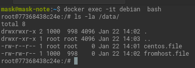

# Домашнее задание к занятию "3. Введение. Экосистема. Архитектура. Жизненный цикл Docker контейнера"

## Как сдавать задания

Обязательными к выполнению являются задачи без указания звездочки. Их выполнение необходимо для получения зачета и диплома о профессиональной переподготовке.

Задачи со звездочкой (*) являются дополнительными задачами и/или задачами повышенной сложности. Они не являются обязательными к выполнению, но помогут вам глубже понять тему.

Домашнее задание выполните в файле readme.md в github репозитории. В личном кабинете отправьте на проверку ссылку на .md-файл в вашем репозитории.

Любые вопросы по решению задач задавайте в чате учебной группы.

---


## Важно!

Перед отправкой работы на проверку удаляйте неиспользуемые ресурсы.
Это важно для того, чтоб предупредить неконтролируемый расход средств, полученных в результате использования промокода.

Подробные рекомендации [здесь](https://github.com/netology-code/virt-homeworks/blob/virt-11/r/README.md)

---

## Задача 1

Сценарий выполения задачи:

- создайте свой репозиторий на https://hub.docker.com;
- выберете любой образ, который содержит веб-сервер Nginx;
- создайте свой fork образа;
- реализуйте функциональность:
запуск веб-сервера в фоне с индекс-страницей, содержащей HTML-код ниже:
```
<html>
<head>
Hey, Netology
</head>
<body>
<h1>I’m DevOps Engineer!</h1>
</body>
</html>
```
Опубликуйте созданный форк в своем репозитории и предоставьте ответ в виде ссылки на https://hub.docker.com/username_repo.

https://hub.docker.com/r/maslovkv/all

Через Dockerfile
https://hub.docker.com/r/maslovkv/nginx

## Задача 2

Посмотрите на сценарий ниже и ответьте на вопрос:
"Подходит ли в этом сценарии использование Docker контейнеров или лучше подойдет виртуальная машина, физическая машина? Может быть возможны разные варианты?"

Детально опишите и обоснуйте свой выбор.

--

Сценарий:

- Высоконагруженное монолитное java веб-приложение;
  
  Физический сервер, нет накладных расходов на виртуализацию.
  
- Nodejs веб-приложение;
  
  Docker. Проще отслеживать зависимости.

- Мобильное приложение c версиями для Android и iOS;

  Виртуальные машины с различными окружениями.

- Шина данных на базе Apache Kafka;
  
  Физические сервера. Нет затрат на виртуализацию. Отказоустойчивость обеспечивается кластеризацией. 
  
- Elasticsearch кластер для реализации логирования продуктивного веб-приложения - три ноды elasticsearch, два logstash и две ноды kibana;

  Подойдут все три варианта, так и смешанные. Всё зависит от нагрузки.  

- Мониторинг-стек на базе Prometheus и Grafana;

  Docker. Удобнее администрировать и масштабировать.

- MongoDB, как основное хранилище данных для java-приложения;
   
  Docker или физические машины.Всё зависит от нагрузки.

- Gitlab сервер для реализации CI/CD процессов и приватный (закрытый) Docker Registry.

  Думаю в большинстве случаев подойдет ВМ.

## Задача 3

- Запустите первый контейнер из образа ***centos*** c любым тэгом в фоновом режиме, подключив папку ```/data``` из текущей рабочей директории на хостовой машине в ```/data``` контейнера;
 
  ``` docker run -v /home/mask/data:/data -dt --name centos centos```
- Запустите второй контейнер из образа ***debian*** в фоновом режиме, подключив папку ```/data``` из текущей рабочей директории на хостовой машине в ```/data``` контейнера;

  ```docker run -v /home/mask/data:/data -dt --name debian debian```
- Подключитесь к первому контейнеру с помощью ```docker exec``` и создайте текстовый файл любого содержания в ```/data```;
  ```commandline
  docker exec -it centos bash
  touch /data/centos.file
  ```
- Добавьте еще один файл в папку ```/data``` на хостовой машине;

  ```touch ./data/fromhost.file```

- Подключитесь во второй контейнер и отобразите листинг и содержание файлов в ```/data``` контейнера.
  
## Задача 4 (*)

Воспроизвести практическую часть лекции самостоятельно.

Соберите Docker образ с Ansible, загрузите на Docker Hub и пришлите ссылку вместе с остальными ответами к задачам.

https://hub.docker.com/r/maslovkv/ansible

---

### Как cдавать задание

Выполненное домашнее задание пришлите ссылкой на .md-файл в вашем репозитории.

---