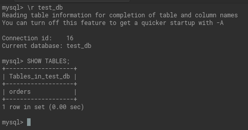
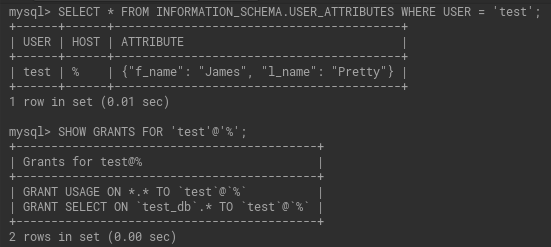
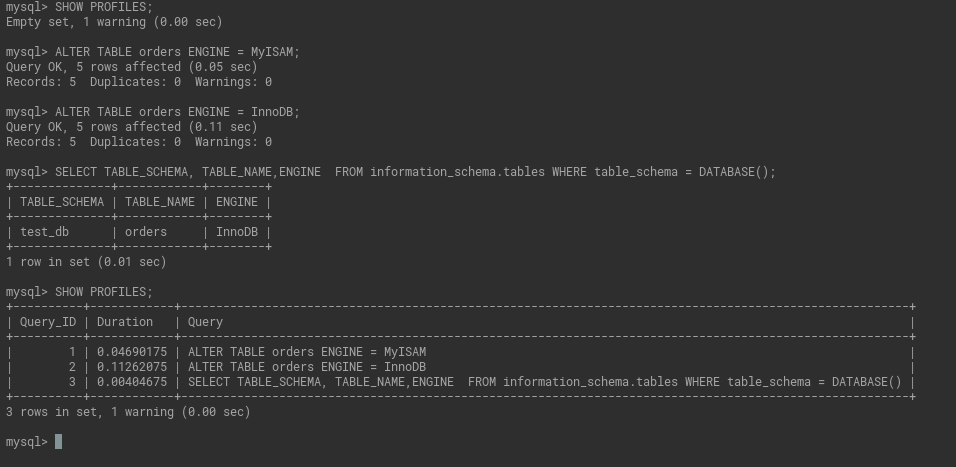
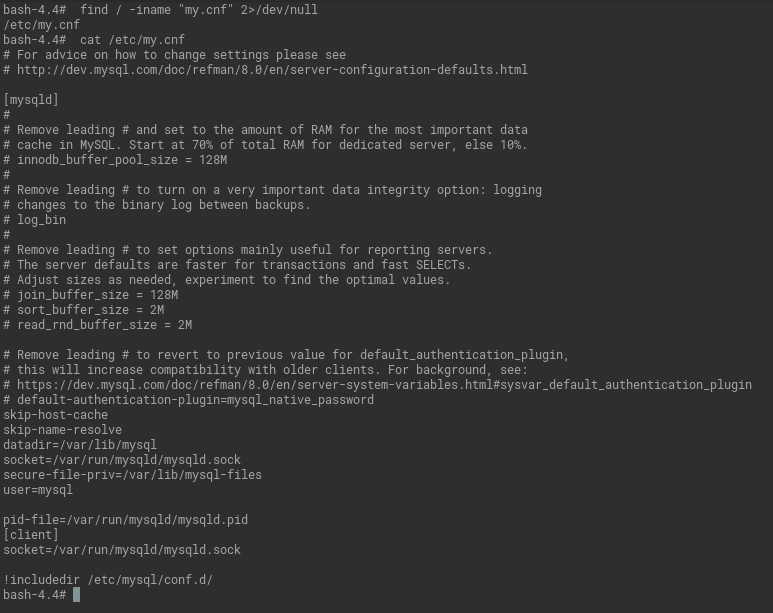

# Домашнее задание к занятию "3. MySQL"

## Введение

Перед выполнением задания вы можете ознакомиться с 
[дополнительными материалами](https://github.com/netology-code/virt-homeworks/blob/virt-11/additional/README.md).

## Задача 1

Используя docker поднимите инстанс MySQL (версию 8). Данные БД сохраните в volume.

[Файл docker-compose.](6.3/stack/docker-compose.yaml)

Изучите [бэкап БД](6.3/stack/mysql/backup/test_dump.sql) и 
восстановитесь из него.

```commandline
docker exec -it mysql bash
mysql -u root -p test_db < /data/backup/test_dump.sql
```
<details>
	<summary>Вывод при добавленном <code>-v</code>.</summary>

```commandline
bash-4.4# mysql -v -u root -p test_db < /data/backup/test_dump.sql 


Enter password: 
--------------
/*!40101 SET @OLD_CHARACTER_SET_CLIENT=@@CHARACTER_SET_CLIENT */
--------------

--------------
/*!40101 SET @OLD_CHARACTER_SET_RESULTS=@@CHARACTER_SET_RESULTS */
--------------

--------------
/*!40101 SET @OLD_COLLATION_CONNECTION=@@COLLATION_CONNECTION */
--------------

--------------
/*!50503 SET NAMES utf8mb4 */
--------------

--------------
/*!40103 SET @OLD_TIME_ZONE=@@TIME_ZONE */
--------------

--------------
/*!40103 SET TIME_ZONE='+00:00' */
--------------

--------------
/*!40014 SET @OLD_UNIQUE_CHECKS=@@UNIQUE_CHECKS, UNIQUE_CHECKS=0 */
--------------

--------------
/*!40014 SET @OLD_FOREIGN_KEY_CHECKS=@@FOREIGN_KEY_CHECKS, FOREIGN_KEY_CHECKS=0 */
--------------

--------------
/*!40101 SET @OLD_SQL_MODE=@@SQL_MODE, SQL_MODE='NO_AUTO_VALUE_ON_ZERO' */
--------------

--------------
/*!40111 SET @OLD_SQL_NOTES=@@SQL_NOTES, SQL_NOTES=0 */
--------------

--------------
DROP TABLE IF EXISTS `orders`
--------------

--------------
/*!40101 SET @saved_cs_client     = @@character_set_client */
--------------

--------------
/*!50503 SET character_set_client = utf8mb4 */
--------------

--------------
CREATE TABLE `orders` (
  `id` int unsigned NOT NULL AUTO_INCREMENT,
  `title` varchar(80) NOT NULL,
  `price` int DEFAULT NULL,
  PRIMARY KEY (`id`)
) ENGINE=InnoDB AUTO_INCREMENT=6 DEFAULT CHARSET=utf8mb4 COLLATE=utf8mb4_0900_ai_ci
--------------

--------------
/*!40101 SET character_set_client = @saved_cs_client */
--------------

--------------
LOCK TABLES `orders` WRITE
--------------

--------------
/*!40000 ALTER TABLE `orders` DISABLE KEYS */
--------------

--------------
INSERT INTO `orders` VALUES (1,'War and Peace',100),(2,'My little pony',500),(3,'Adventure mysql times',300),(4,'Server gravity falls',300),(5,'Log gossips',123)
--------------

--------------
/*!40000 ALTER TABLE `orders` ENABLE KEYS */
--------------

--------------
UNLOCK TABLES
--------------

--------------
/*!40103 SET TIME_ZONE=@OLD_TIME_ZONE */
--------------

--------------
/*!40101 SET SQL_MODE=@OLD_SQL_MODE */
--------------

--------------
/*!40014 SET FOREIGN_KEY_CHECKS=@OLD_FOREIGN_KEY_CHECKS */
--------------

--------------
/*!40014 SET UNIQUE_CHECKS=@OLD_UNIQUE_CHECKS */
--------------

--------------
/*!40101 SET CHARACTER_SET_CLIENT=@OLD_CHARACTER_SET_CLIENT */
--------------

--------------
/*!40101 SET CHARACTER_SET_RESULTS=@OLD_CHARACTER_SET_RESULTS */
--------------

--------------
/*!40101 SET COLLATION_CONNECTION=@OLD_COLLATION_CONNECTION */
--------------

--------------
/*!40111 SET SQL_NOTES=@OLD_SQL_NOTES */
--------------
```
</details>

Перейдите в управляющую консоль `mysql` внутри контейнера.

```commandline
mysql -u root -p
```

Используя команду `\h` получите список управляющих команд.

Найдите команду для выдачи статуса БД и **приведите в ответе** из ее вывода версию сервера БД.

```commandline
\s
Server version:		8.0.32 MySQL Community Server - GPL
``` 

<details>
  <summary>Вывод</summary>


</details>

Подключитесь к восстановленной БД и получите список таблиц из этой БД.

```commandline
\r test_db
SHOW TABLES;
```
<details>
  <summary>Вывод</summary>


</details>

**Приведите в ответе** количество записей с `price` > 300.

`SELECT COUNT(*) FROM orders WHERE price > 300;`


В следующих заданиях мы будем продолжать работу с данным контейнером.

## Задача 2

Создайте пользователя test в БД c паролем test-pass, используя:
- плагин авторизации mysql_native_password
- срок истечения пароля - 180 дней 
- количество попыток авторизации - 3 
- максимальное количество запросов в час - 100
- аттрибуты пользователя:
    - Фамилия "Pretty"
    - Имя "James"

<details>
  <summary>Создание</summary>

```commandline
CREATE USER 'test'@'%' 
IDENTIFIED WITH mysql_native_password BY 'test-pass'
WITH MAX_QUERIES_PER_HOUR 100
PASSWORD EXPIRE INTERVAL 180 DAY
FAILED_LOGIN_ATTEMPTS 3 PASSWORD_LOCK_TIME UNBOUNDED
ATTRIBUTE '{"l_name":"Pretty","f_name":"James"}';
```

</details>

Предоставьте привелегии пользователю `test` на операции SELECT базы `test_db`.

<details>
  <summary>Права</summary>

```commandline
GRANT SELECT ON test_db.* TO 'test'@'%';
```
 
</details>   

Используя таблицу INFORMATION_SCHEMA.USER_ATTRIBUTES получите данные по пользователю `test` и 
**приведите в ответе к задаче**.

<details>
  <summary>Комманды</summary>

```commandline
SELECT * FROM INFORMATION_SCHEMA.USER_ATTRIBUTES WHERE USER = 'test';
SHOW GRANTS FOR 'test'@'%';
```

</details>



## Задача 3

Установите профилирование `SET profiling = 1;`.
Изучите вывод профилирования команд `SHOW PROFILES;`.

Исследуйте, какой `engine` используется в таблице БД `test_db` и **приведите в ответе**.

`SELECT TABLE_SCHEMA, TABLE_NAME,ENGINE  FROM information_schema.tables WHERE table_schema = DATABASE();`


Измените `engine` и **приведите время выполнения и запрос на изменения из профайлера в ответе**:

- на `MyISAM`

  `ALTER TABLE orders ENGINE = MyISAM;`
- на `InnoDB`

  `ALTER TABLE orders ENGINE = InnoDB;`


## Задача 4 

Изучите файл `my.cnf` в директории /etc/mysql.

<details>
  <summary>Детали</summary>

Такого файла нет в контейнере. Поэтом у будем использовать `/etc/my.cnf`



</details>

Измените его согласно ТЗ (движок InnoDB):
`default-storage-engine=innodb`


- Скорость IO важнее сохранности данных

  `innodb_flush_log_at_trx_commit=1`

- Нужна компрессия таблиц для экономии места на диске

  `innodb_file_per_table=ON`

- Размер буффера с незакомиченными транзакциями 1 Мб

  `innodb_log_buffer_size=1M`
- Буффер кеширования 30% от ОЗУ ( на ВМ выделено 2G RAM)

  `innodb_buffer_pool_size=79901491`

- Размер файла логов операций 100 Мб

  `innodb_log_file_size=100M `

Приведите в ответе измененный файл `my.cnf`.


Или [my.cnf](6.3/stack/mysql/backup/my.cnf)

---

### Как оформить ДЗ?

Выполненное домашнее задание пришлите ссылкой на .md-файл в вашем репозитории.

---
