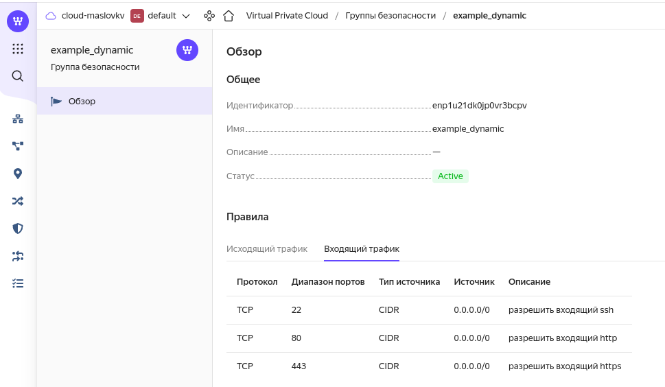
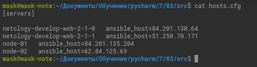
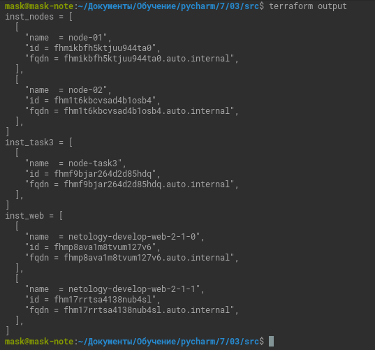

# Домашнее задание к занятию "Управляющие конструкции в коде Terraform"

### Цель задания

1. Научиться гибко управлять ресурсами в облаке Yandex Cloud с помощью Terraform.
2. Освоить работу с переменными Terraform

------

### Чеклист готовности к домашнему заданию

1. Зарегистрирован аккаунт в Yandex Cloud. Использован промокод на грант.
2. Установлен инструмент yandex cli.
3. Доступен исходный код для выполнения задания в директории [**03/src**](https://github.com/netology-code/ter-homeworks/tree/main/03/src).
4. Любые ВМ, использованные при выполнении задания должны быть прерываемыми, для экономии средств.

------

### Инструменты/ дополнительные материалы, которые пригодятся для выполнения задания

1. [Консоль управления Yandex Cloud](https://console.cloud.yandex.ru/folders/<cloud_id>/vpc/security-groups).
2. [Группы безопасности](https://cloud.yandex.ru/docs/vpc/concepts/security-groups?from=int-console-help-center-or-nav).
3. [Datasource compute disk](https://terraform-eap.website.yandexcloud.net/docs/providers/yandex/d/datasource_compute_disk.html).


### Задание 1

1. Изучите проект.
2. Заполните файл personal.auto.tfvars
3. Инициализируйте проект, выполните код (он выполнится даже если доступа к preview нет).

Примечание: Если у вас не активирован preview доступ к функционалу "Группы безопасности" в Yandex Cloud - запросите доступ у поддержки облачного провайдера. Обычно его выдают в течении 24-х часов.

Приложите скриншот входящих правил "Группы безопасности" в ЛК Yandex Cloud  или скриншот отказа в предоставлении доступа к preview версии.



------

### Задание 2

1. Создайте файл [count-vm.tf](03/src/count-vm.tf). Опишите в нем создание двух **одинаковых** виртуальных машин с минимальными параметрами, используя мета-аргумент **count loop**.

   

2. Создайте файл [for_each-vm.tf](03/src/for_each-vm.tf). Опишите в нем создание 2 **разных** по cpu/ram/disk виртуальных машин, используя мета-аргумент **for_each loop**. Используйте переменную типа list(object({ vm_name=string, cpu=number, ram=number, disk=number  })). При желании внесите в переменную все возможные параметры.
<details><summary>3. ВМ из пункта 2.2 должны создаваться после создания ВМ из пункта 2.1.</summary>

`depends_on = [yandex_compute_instance.web]`

</details>

<details><summary>4. Используйте функцию file в local переменной для считывания ключа ~/.ssh/id_rsa.pub и его последующего использования в блоке metadata, взятому из ДЗ №2.</summary>

[locals.tf](03/src/locals.tf)

</details>

5. Инициализируйте проект, выполните код.

------

### Задание 3

<details><summary>1. Создайте 3 одинаковых виртуальных диска, размером 1 Гб с помощью ресурса yandex_compute_disk и мета-аргумента count.</summary>

```terraform
resource "yandex_compute_disk" "disk-task-3" {
  count = 3
  name        = "disk-task-3-${count.index}"
  type       = var.disk_task-3.type
  zone       = var.default_zone
  size       = var.disk_task-3.size
  block_size = var.disk_task-3.block_size
}
```

</details>
<details><summary>2. Создайте одну **любую** ВМ. Используйте блок **dynamic secondary_disk{..}** и мета-аргумент for_each для подключения созданных вами дополнительных дисков.</summary>

```terraform
 dynamic secondary_disk {
    for_each = "${yandex_compute_disk.disk-task-3.*.id}"

    content {
      disk_id = yandex_compute_disk.disk-task-3["${secondary_disk.key}"].id
      auto_delete = var.disk_task-3.auto_delete
    }

 }

```

</details>
<details><summary>3. Назначьте ВМ созданную в 1-м задании группу безопасности.</summary>

```terraform
network_interface {
    subnet_id = yandex_vpc_subnet.develop.id
    nat       = true
    security_group_ids = [
      "${yandex_vpc_security_group.example.id}"
    ]
  }

```

</details>

[task3.tf](03/src/task3.tf)

------

### Задание 4

1. Создайте inventory-файл для ansible.
Используйте функцию [tepmplatefile](03/src/main.tf) и [файл-шаблон](03/src/hosts.tftpl) для создания ansible inventory-файла из лекции.
Готовый код возьмите из демонстрации к лекции [**demonstration2**](https://github.com/netology-code/ter-homeworks/tree/main/demonstration2).
Передайте в него в качестве переменных имена и внешние ip-адреса ВМ из задания 2.1 и 2.2.
2. Выполните код. Приложите скриншот получившегося файла.



Для общего зачета создайте в вашем GitHub репозитории новую ветку terraform-03. Закомитьте в эту ветку свой финальный код проекта, пришлите ссылку на коммит.   
**Удалите все созданные ресурсы**.

------

## Дополнительные задания (со звездочкой*)

**Настоятельно рекомендуем выполнять все задания под звёздочкой.**   Их выполнение поможет глубже разобраться в материале.   
Задания под звёздочкой дополнительные (необязательные к выполнению) и никак не повлияют на получение вами зачета по этому домашнему заданию. 

### Задание 5*(необязательное)
1. Напишите output, который отобразит все 5 созданных ВМ в виде списка словарей:
``` 
[
 {
  "name" = 'имя ВМ1'
  "id"   = 'идентификатор ВМ1'
  "fqdn" = 'Внутренний FQDN ВМ1'
 },
 {
  "name" = 'имя ВМ2'
  "id"   = 'идентификатор ВМ2'
  "fqdn" = 'Внутренний FQDN ВМ2'
 },
 ....
]
```
Приложите скриншот вывода команды ```terrafrom output```

Как выше не получилось, может не туда копал.



------

### Задание 6*(необязательное)

1. Используя null_resource и local-exec примените ansible-playbook к ВМ из ansible inventory файла.
Готовый код возьмите из демонстрации к лекции [**demonstration2**](https://github.com/netology-code/ter-homeworks/tree/main/demonstration2).
3. Дополните файл шаблон hosts.tftpl. 
Формат готового файла:
```netology-develop-platform-web-0   ansible_host="<внешний IP-address или внутренний IP-address если у ВМ отсутвует внешний адрес>"```

Для проверки работы уберите у ВМ внешние адреса. Этот вариант используется при работе через bastion сервер.
Для зачета предоставьте код вместе с основной частью задания.
[hosts.tftpl](03/src/hosts.tftpl)
### Правила приема работы

В своём git-репозитории создайте новую ветку terraform-03, закомитьте в эту ветку свой финальный код проекта. Ответы на задания и необходимые скриншоты оформите в md-файле в ветке terraform-03.

В качестве результата прикрепите ссылку на ветку terraform-03 в вашем репозитории.

ВАЖНО!Удалите все созданные ресурсы.

### Критерии оценки

Зачёт:

* выполнены все задания;
* ответы даны в развёрнутой форме;
* приложены соответствующие скриншоты и файлы проекта;
* в выполненных заданиях нет противоречий и нарушения логики.

На доработку:

* задание выполнено частично или не выполнено вообще;
* в логике выполнения заданий есть противоречия и существенные недостатки. 

