# Домашнее задание к занятию "Продвинутые методы работы с Terraform"

### Цель задания

1. Научиться использовать модули.
2. Отработать операции state.
3. Закрепить пройденный материал.


### Чеклист готовности к домашнему заданию

1. Зарегистрирован аккаунт в Yandex Cloud. Использован промокод на грант.
2. Установлен инструмент yandex CLI
3. Исходный код для выполнения задания расположен в директории [**04/src**](https://github.com/netology-code/ter-homeworks/tree/main/04/src).
4. Любые ВМ, использованные при выполнении задания должны быть прерываемыми, для экономии средств.

------

### Задание 1

1. Возьмите из [демонстрации к лекции готовый код](https://github.com/netology-code/ter-homeworks/tree/main/04/demonstration1) для создания ВМ с помощью remote модуля.
2. Создайте 1 ВМ, используя данный модуль. В файле cloud-init.yml необходимо использовать переменную для ssh ключа вместо хардкода. Передайте ssh-ключ в функцию template_file в блоке vars ={} .
Воспользуйтесь [**примером**](https://grantorchard.com/dynamic-cloudinit-content-with-terraform-file-templates/). Обратите внимание что ssh-authorized-keys принимает в себя список, а не строку!
 

   Заменим  `instance_count  = 1` в [main.tf](04/demonstration1/main.tf). 
   Добавим `ssh_public_key = "~/.ssh/id_rsa.pub"` в `personal.auto.tfvars` 

   Заменим 
   ```
   ssh_authorized_keys:
      - ssh-rsa AAAAB3NzaC1yc2EAAAADAQABAAABgQDPXmhw8Z72tEeCJ7M/q1Yr8NUflzwcdehG4qBPvModvk+PXxUpo60A+v5zswg8cMk8jThbDcOL9dwMeQBS23ArbiuteFaHN2q4yTbLn3LtLkwFaHzI3BRq4wKmmirCm32Z9P9xe0ZagQp97M2RuKmaMnHIMCxzwpPSYn1hTbxrncXYV1K9IqUv6SqSas2vFuRoIhOuJkzeeY2Ypno7grImPYFzk2Jt7vbZp3iS7DjfrEcWd1KkSl8nhoWnffJtH3m00JhYt9xPeCszbMafXWgNdZunCkGCwnAAzFxzZP91gZnwneVFgp0CK8qG8MkROR6o3+6cbW2NrEzj4YIVgrM0AFawSwFDEr+CiEdKHlNH5hI574b/UUJMHVL1A9wKpUYnQV0YoWdteDi2mwGYMkAYkDC3DjHg+0Swab9NU/D+AUDqngfZxkJdJn6CHIn9kOSQAuoLFJFqozFMPOzNCXhJS255a5as5Zr/WsmTB4TLMNPhV4LMmpKS00zdF0kmoyU= udjin@yoga7
   ``` 
   на
   ```commandline
   ssh_authorized_keys:
      - ${ssh_public_key}
   ```
   в [cloud-init.yml](04/demonstration1/cloud-init.yml).

   Добавим `ssh_public_key = "~/.ssh/id_rsa.pub"` в `personal.auto.tfvars`
3. Добавьте в файл cloud-init.yml установку nginx. 
   
   ```commandline
       packages:
      - vim
      - nginx
   ```
4. Предоставьте скриншот подключения к консоли и вывод команды ```nginx -t```.

   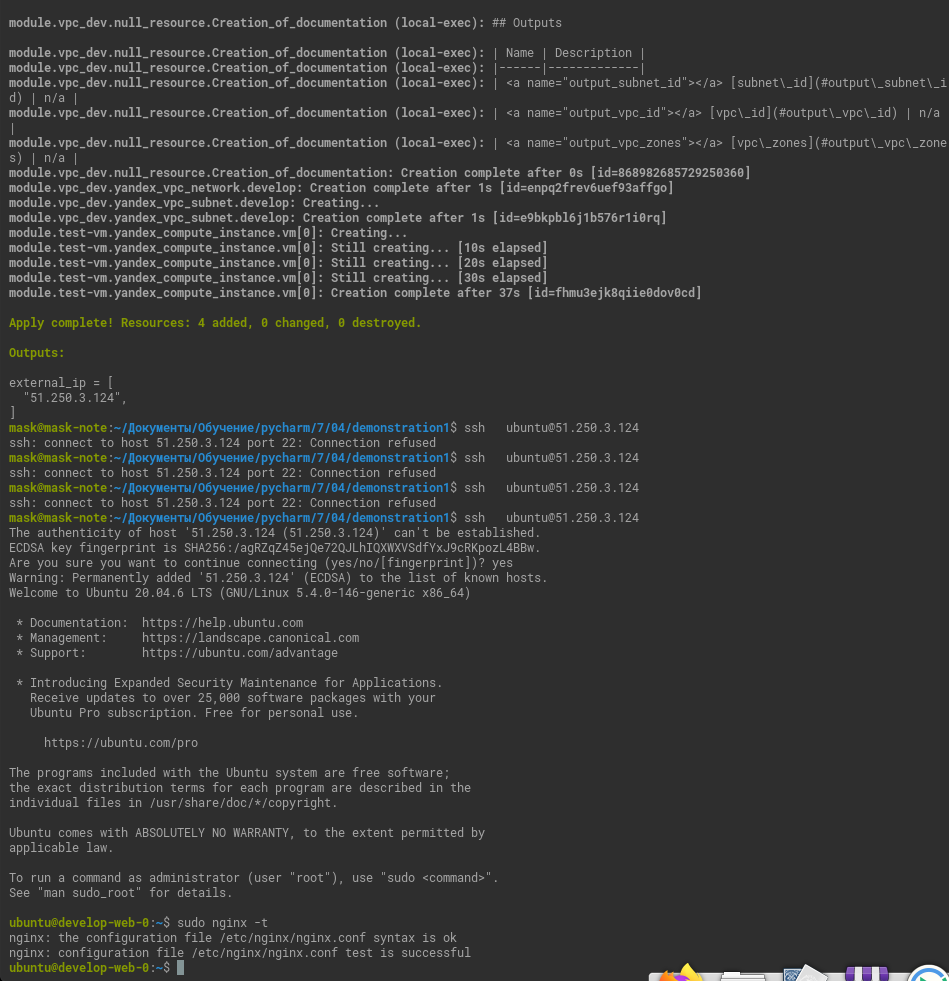

------

### Задание 2

1. [Напишите локальный модуль vpc, который будет создавать 2 ресурса: **одну** сеть и **одну** подсеть в зоне, объявленной при вызове модуля. например: ```ru-central1-a```.](04/demonstration1/vpc)

2. [Модуль должен возвращать значения vpc.id и subnet.id](04/demonstration1/vpc/outputs.tf)
3. [Замените ресурсы yandex_vpc_network и yandex_vpc_subnet, созданным модулем.](04/demonstration1/main.tf)
4. [Сгенерируйте документацию к модулю с помощью terraform-docs.](04/demonstration1/vpc/docs.tf)    
 
Пример вызова:
```
module "vpc_dev" {
  source       = "./vpc"
  env_name     = "develop"
  zone = "ru-central1-a"
  cidr = "10.0.1.0/24"
}
```

### Задание 3

<details><summary>0. backup state</summary>
<code>cp terraform.tfstate terraform.tfstate.back</code>
</details>

<details><summary>1. Выведите список ресурсов в стейте.<br><code>terraform state list</code> </summary>

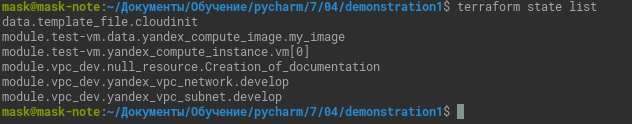

</details>

<details><summary>2. Удалите из стейта модуль vpc.<br>
<code>terraform state rm 'module.vpc_dev'</code></summary>

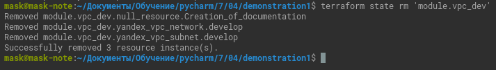

</details>

3. Импортируйте его обратно. Проверьте terraform plan - изменений быть не должно.
Приложите список выполненных команд и вывод.

<details><summary><code>
grep -HiRn -e  'module.vpc_dev.' -e '"id"' -e '"type"' ./terraform.tfstate.back</code></summary>

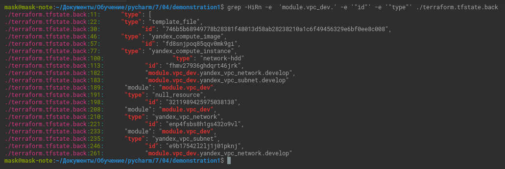
</details>

<details><summary><code>
terraform import 'module.vpc_dev.yandex_vpc_network.develop' 'enp4fsbs8h1gs432o9vl'
</code></summary>

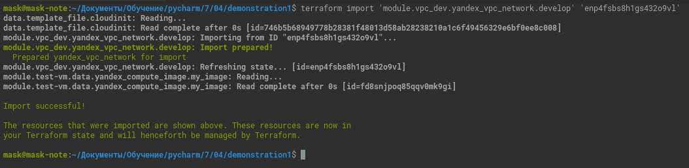
</details>
<details><summary><code>
terraform import 'module.vpc_dev.yandex_vpc_subnet.develop' 'e9b17542l2lj1j01pknj'
</code></summary>

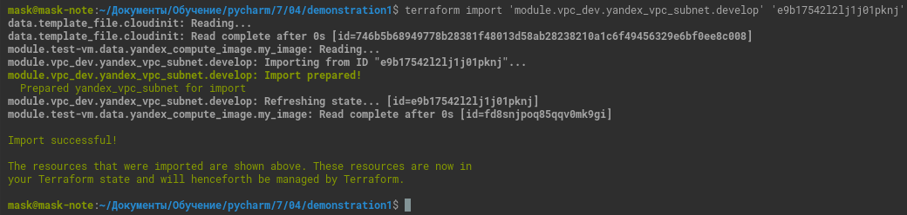
</details>
<details><summary><code>
terraform plan
</code></summary>

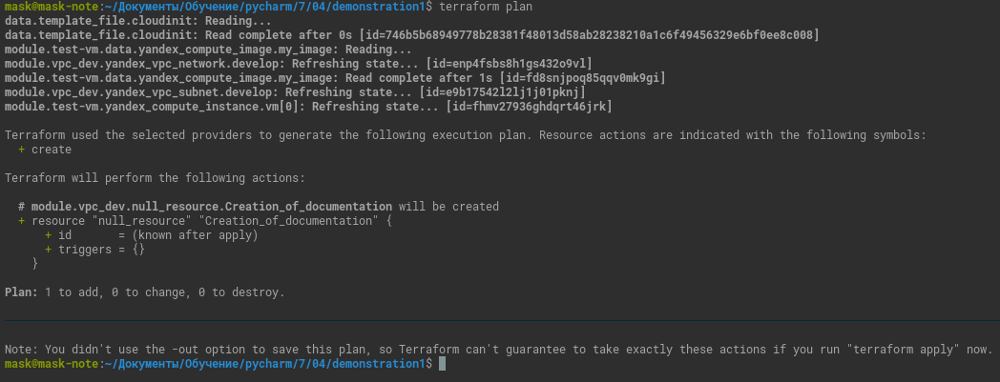
</details>

Изменения есть только в `module.vpc_dev.null_resource.Creation_of_documentation`,
но они и должны [быть](04/demonstration1/vpc/docs.tf).
<details><summary>
Если я правильно понял, данный ресурс не поддерживает импорт.
</summary>

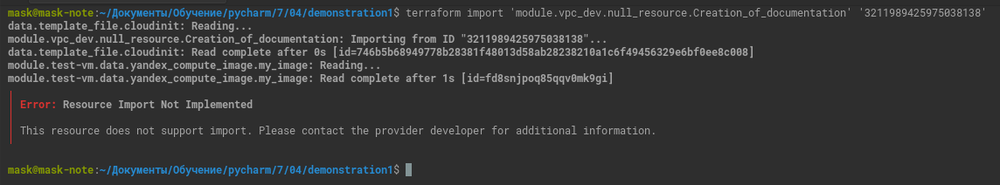
</details>


## Дополнительные задания (со звездочкой*)

**Настоятельно рекомендуем выполнять все задания под звёздочкой.**   Их выполнение поможет глубже разобраться в материале.   
Задания под звёздочкой дополнительные (необязательные к выполнению) и никак не повлияют на получение вами зачета по этому домашнему заданию. 


### Задание 4*

1. Измените модуль vpc так, чтобы он мог создать подсети во всех зонах доступности, переданных в переменной типа list(object) при вызове модуля.  
  
Пример вызова:
```
module "vpc_prod" {
  source       = "./vpc"
  env_name     = "production"
  subnets = [
    { zone = "ru-central1-a", cidr = "10.0.1.0/24" },
    { zone = "ru-central1-b", cidr = "10.0.2.0/24" },
    { zone = "ru-central1-c", cidr = "10.0.3.0/24" },
  ]
}

module "vpc_dev" {
  source       = "./vpc"
  env_name     = "develop"
  subnets = [
    { zone = "ru-central1-a", cidr = "10.0.1.0/24" },
  ]
}
```

Предоставьте код, план выполнения, результат из консоли YC.

[Код](04/task4/vpc/main.tf)

[План](04/task4/plan)

Результат

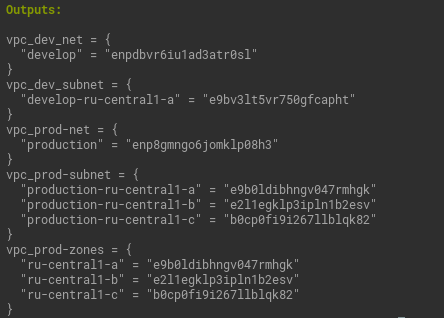
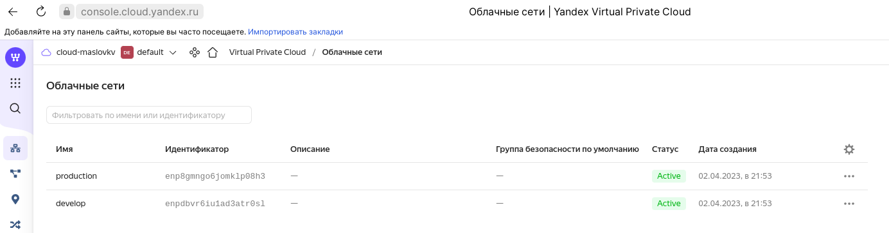
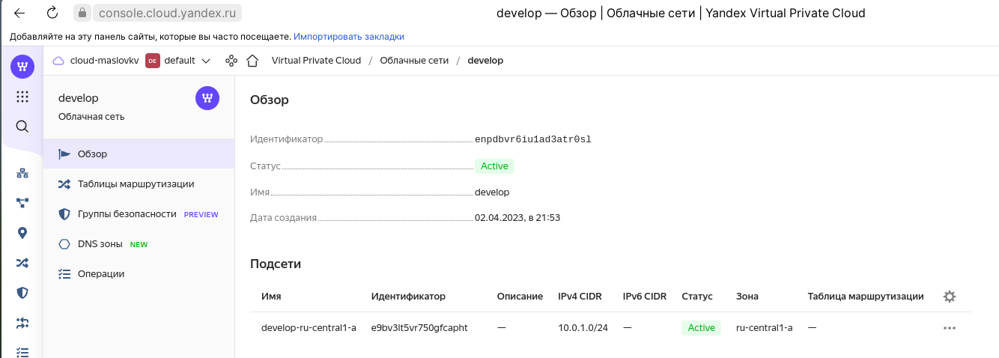
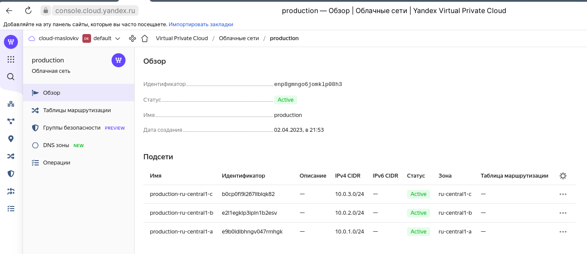

### Задание 5**

1. Напишите модуль для создания кластера managed БД Mysql в Yandex Cloud с 1 или 3 хостами в зависимости от переменной HA=true или HA=false. Используйте ресурс yandex_mdb_mysql_cluster (передайте имя кластера и id сети).
2. Напишите модуль для создания базы данных и пользователя в уже существующем кластере managed БД Mysql. Используйте ресурсы yandex_mdb_mysql_database и yandex_mdb_mysql_user (передайте имя базы данных, имя пользователя и id кластера при вызове модуля).
3. Используя оба модуля, создайте кластер example из одного хоста, а затем добавьте в него БД test и пользователя app. Затем измените переменную и превратите сингл хост в кластер из 2х серверов.
4. 
Предоставьте план выполнения и по-возможности результат. Сразу же удаляйте созданные ресурсы, так как кластер может стоить очень дорого! Используйте минимальную конфигурацию.

### Задание 6***  

1. Разверните у себя локально vault, используя docker-compose.yml в проекте.
2. Для входа в web интерфейс и авторизации terraform в vault используйте токен "education"
3. Создайте новый секрет по пути http://127.0.0.1:8200/ui/vault/secrets/secret/create  
Path: example  
secret data key: test 
secret data value: congrats!  
4. Считайте данный секрет с помощью terraform и выведите его в output по примеру:
```
provider "vault" {
 address = "https://<IP_ADDRESS>:<PORT_NUMBER>"
 skip_tls_verify = true
 token = "education"
}
data "vault_generic_secret" "vault_example"{
 path = "secret/example"
}
output "vault_example" {
 value = "${data.vault_generic_secret.vault_example.data["value"]}"
}
```
5. Попробуйте разобраться в документации и записать новый секрет в vault с помощью terraform. 


### Правила приема работы

В своём git-репозитории создайте новую ветку terraform-04, закомитьте в эту ветку свой финальный код проекта. Ответы на задания и необходимые скриншоты оформите в md-файле в ветке terraform-04.

В качестве результата прикрепите ссылку на ветку terraform-04 в вашем репозитории.

ВАЖНО!Удалите все созданные ресурсы.

### Критерии оценки

Зачёт:

* выполнены все задания;
* ответы даны в развёрнутой форме;
* приложены соответствующие скриншоты и файлы проекта;
* в выполненных заданиях нет противоречий и нарушения логики.

На доработку:

* задание выполнено частично или не выполнено вообще;
* в логике выполнения заданий есть противоречия и существенные недостатки. 


