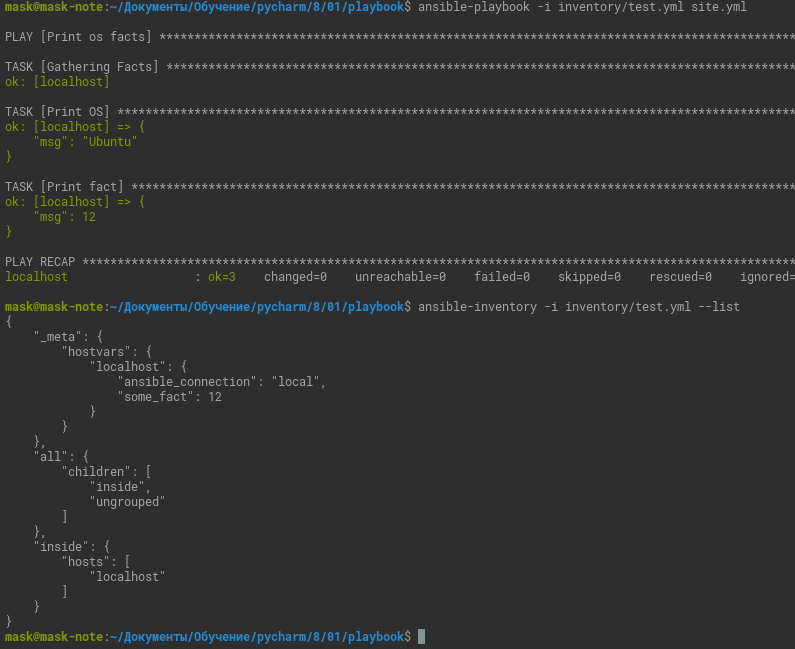
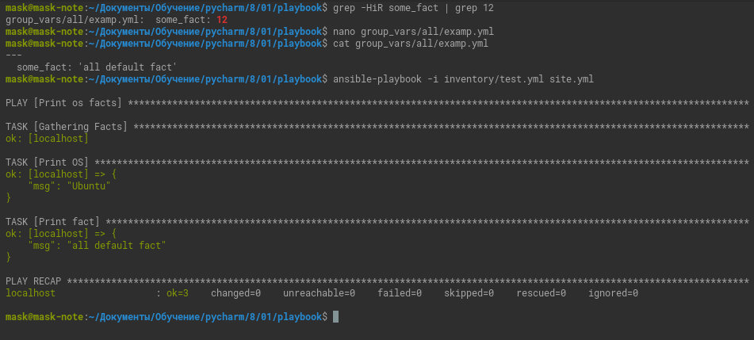
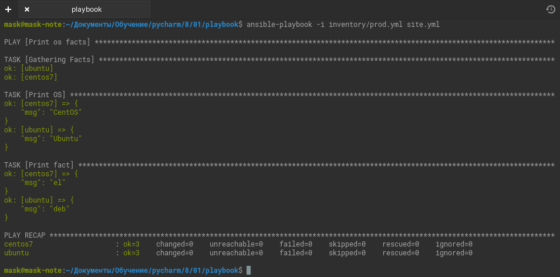
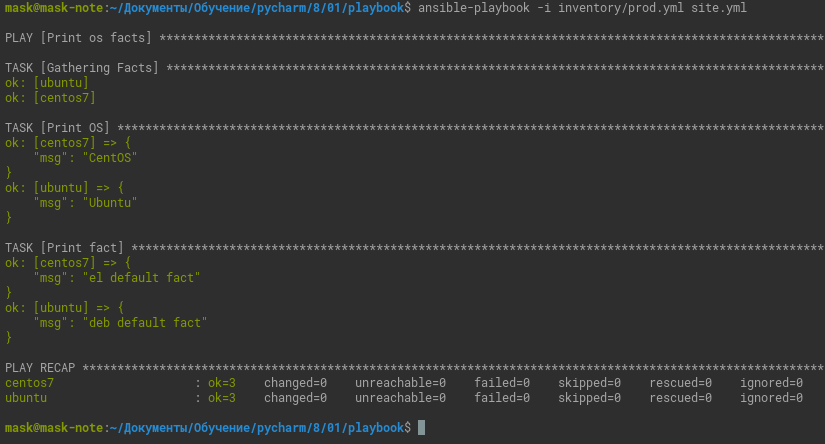
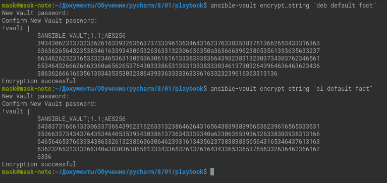
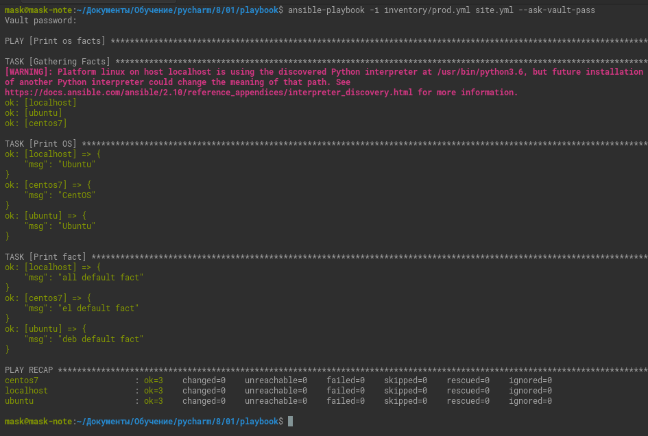

# Домашнее задание к занятию 1 «Введение в Ansible»

## Подготовка к выполнению

1. Установите Ansible версии 2.10 или выше.
2. Создайте свой публичный репозиторий на GitHub с произвольным именем.
3. Скачайте [Playbook](./playbook/) из репозитория с домашним заданием и перенесите его в свой репозиторий.

## Основная часть

1. Попробуйте запустить playbook на окружении из `test.yml`, зафиксируйте значение, которое имеет факт `some_fact` для указанного хоста при выполнении playbook.
<br> `ansible-playbook -i inventory/test.yml site.yml`



2. Найдите файл с переменными (group_vars), в котором задаётся найденное в первом пункте значение, и поменяйте его на `all default fact`.



3. Воспользуйтесь подготовленным (используется `docker`) или создайте собственное окружение для проведения дальнейших испытаний.

   ```commandline
   docker run -dt --name ubuntu  pycontribs/ubuntu && \
   docker run -dt --name centos7  pycontribs/centos:7 
   ```
4. Проведите запуск playbook на окружении из `prod.yml`. Зафиксируйте полученные значения `some_fact` для каждого из `managed host`.

   

5. Добавьте факты в `group_vars` каждой из групп хостов так, чтобы для `some_fact` получились значения: для [`deb`](playbook/group_vars/deb/examp.yml) — `deb default fact`, для [`el`](playbook/group_vars/el/examp.yml) — `el default fact`.
6. Повторите запуск playbook на окружении `prod.yml`. Убедитесь, что выдаются корректные значения для всех хостов.

   

7. При помощи `ansible-vault` зашифруйте факты в `group_vars/deb` и `group_vars/el` с паролем `netology`.

   ```commandline
   ansible-vault encrypt_string "deb default fact"
   ansible-vault encrypt_string "el default fact"
   ```   
  

8. Запустите playbook на окружении `prod.yml`. При запуске `ansible` должен запросить у вас пароль. Убедитесь в работоспособности.

   `ansible-playbook -i inventory/prod.yml site.yml --ask-vault-pass`

<br>

   
9. Посмотрите при помощи `ansible-doc` список плагинов для подключения. Выберите подходящий для работы на `control node`.

   

10. В [`prod.yml`](playbook/inventory/prod.yml) добавьте новую группу хостов с именем  `local`, в ней разместите localhost с необходимым типом подключения.
11. Запустите playbook на окружении `prod.yml`. При запуске `ansible` должен запросить у вас пароль. Убедитесь, что факты `some_fact` для каждого из хостов определены из верных `group_vars`.

      

12. Заполните `README.md` ответами на вопросы. Сделайте `git push` в ветку `master`. В ответе отправьте ссылку на ваш открытый репозиторий с изменённым `playbook` и заполненным `README.md`.

[Самоконтроль выполненения задания.](playbook/README.md)

## Необязательная часть

1. При помощи `ansible-vault` расшифруйте все зашифрованные файлы с переменными.

   В задании было `зашифруйте факты`.
2. Зашифруйте отдельное значение `PaSSw0rd` для переменной `some_fact` паролем `netology`. Добавьте полученное значение в `group_vars/all/exmp.yml`.
    
   `ansible-vault encrypt_string PaSSw0rd`

3. Запустите `playbook`, убедитесь, что для нужных хостов применился новый `fact`.

   

4. Добавьте [новую группу хостов](playbook/inventory/prod.yml) `fedora`, самостоятельно придумайте для неё [переменную](playbook/group_vars/fed/examp.yml). В качестве образа можно использовать [этот вариант](https://hub.docker.com/r/pycontribs/fedora).
5. Напишите скрипт на bash: автоматизируйте поднятие необходимых контейнеров, запуск ansible-playbook и остановку контейнеров.
   
   [Скрипт](playbook/1.sh)

6. Все изменения должны быть зафиксированы и отправлены в ваш личный репозиторий.

---

### Как оформить решение задания

Выполненное домашнее задание пришлите в виде ссылки на .md-файл в вашем репозитории.

---
