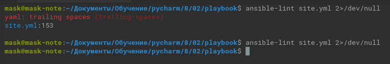
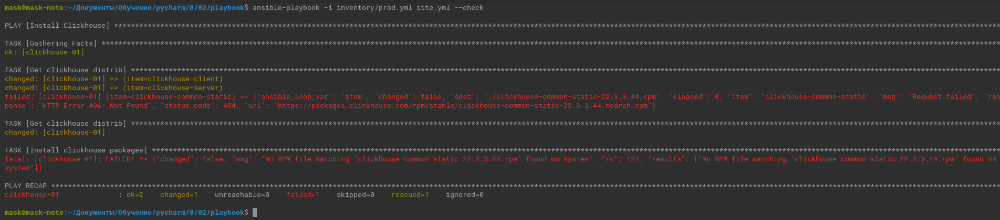
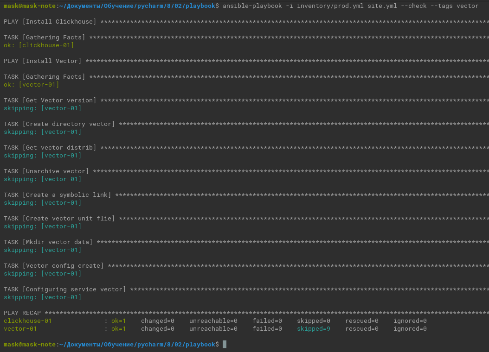

# Домашнее задание к занятию 2 «Работа с Playbook»

## Подготовка к выполнению

1. * Необязательно. Изучите, что такое [ClickHouse](https://www.youtube.com/watch?v=fjTNS2zkeBs) и [Vector](https://www.youtube.com/watch?v=CgEhyffisLY).
2. Создайте свой публичный репозиторий на GitHub с произвольным именем или используйте старый.
3. Скачайте [Playbook](./playbook/) из репозитория с домашним заданием и перенесите его в свой репозиторий.
4. Подготовьте хосты в соответствии с группами из предподготовленного playbook.

## Основная часть

1. Подготовьте свой inventory-файл [prod.yml](./playbook/inventory/prod.yml).
2. Допишите [playbook](./playbook/site.yml): нужно сделать ещё один play, который устанавливает и настраивает [vector](https://vector.dev).
3. При создании tasks рекомендую использовать модули: `get_url`, `template`, `unarchive`, `file`.
4. Tasks должны: скачать дистрибутив нужной версии, выполнить распаковку в выбранную директорию, установить vector.
5. Запустите `ansible-lint site.yml` и исправьте ошибки, если они есть.

   
6. Попробуйте запустить playbook на этом окружении с флагом `--check`.
   
   
  
   
7. Запустите playbook на `prod.yml` окружении с флагом `--diff`. Убедитесь, что изменения на системе произведены.
   
<details><summary>вывод</summary>
   
```commandline
mask@mask-note:~/Документы/Обучение/pycharm/8/02/playbook$ ansible-playbook -i inventory/prod.yml site.yml --diff

PLAY [Install Clickhouse] *******************************************************************************************************************************************************************************************************************

TASK [Gathering Facts] **********************************************************************************************************************************************************************************************************************
ok: [clickhouse-01]

TASK [Get clickhouse distrib] ***************************************************************************************************************************************************************************************************************
changed: [clickhouse-01] => (item=clickhouse-client)
changed: [clickhouse-01] => (item=clickhouse-server)
failed: [clickhouse-01] (item=clickhouse-common-static) => {"ansible_loop_var": "item", "changed": false, "dest": "./clickhouse-common-static-22.3.3.44.rpm", "elapsed": 0, "item": "clickhouse-common-static", "msg": "Request failed", "response": "HTTP Error 404: Not Found", "status_code": 404, "url": "https://packages.clickhouse.com/rpm/stable/clickhouse-common-static-22.3.3.44.noarch.rpm"}

TASK [Get clickhouse distrib] ***************************************************************************************************************************************************************************************************************
changed: [clickhouse-01]

TASK [Install clickhouse packages] **********************************************************************************************************************************************************************************************************
changed: [clickhouse-01]

RUNNING HANDLER [Start clickhouse service] **************************************************************************************************************************************************************************************************
changed: [clickhouse-01]

TASK [Pause for 10 seconds.] ****************************************************************************************************************************************************************************************************************
Pausing for 10 seconds
(ctrl+C then 'C' = continue early, ctrl+C then 'A' = abort)
ok: [clickhouse-01]

TASK [Create database] **********************************************************************************************************************************************************************************************************************
changed: [clickhouse-01]

PLAY [Install Vector] ***********************************************************************************************************************************************************************************************************************

TASK [Gathering Facts] **********************************************************************************************************************************************************************************************************************
ok: [vector-01]

TASK [Get Vector version] *******************************************************************************************************************************************************************************************************************
fatal: [vector-01]: FAILED! => {"changed": false, "cmd": "vector --version", "failed_when_result": true, "msg": "[Errno 2] Нет такого файла или каталога", "rc": 2}
...ignoring

TASK [Create directory vector] **************************************************************************************************************************************************************************************************************
--- before
+++ after
@@ -1,4 +1,4 @@
 {
     "path": "/opt/vector",
-    "state": "absent"
+    "state": "directory"
 }

changed: [vector-01]

TASK [Get vector distrib] *******************************************************************************************************************************************************************************************************************
changed: [vector-01]

TASK [Unarchive vector] *********************************************************************************************************************************************************************************************************************
changed: [vector-01]

TASK [Create a symbolic link] ***************************************************************************************************************************************************************************************************************
--- before
+++ after
@@ -1,6 +1,6 @@
 {
-    "group": 1000,
-    "owner": 1000,
+    "group": 0,
+    "owner": 0,
     "path": "/usr/bin/vector",
-    "state": "absent"
+    "state": "link"
 }

changed: [vector-01]

TASK [Create vector unit flie] **************************************************************************************************************************************************************************************************************
--- before
+++ after: /home/mask/.ansible/tmp/ansible-local-136962g7p_p0vk/tmp_xc5l13f/vector.service.j2
@@ -0,0 +1,22 @@
+[Unit]
+Description=Vector
+Documentation=https://vector.dev
+After=network-online.target
+Requires=network-online.target
+
+[Service]
+User=root
+Group=root
+ExecStartPre=/opt/vector/bin/vector validate --config-toml /opt/vector/config/vector.toml
+ExecStart=/opt/vector/bin/vector --config-toml /opt/vector/config/vector.toml
+ExecReload=/opt/vector/bin/vector validate --config-toml/opt/vector/config/vector.toml
+ExecReload=/bin/kill -HUP $MAINPID
+Restart=always
+AmbientCapabilities=CAP_NET_BIND_SERVICE
+EnvironmentFile=-/etc/default/vector
+# Since systemd 229, should be in [Unit] but in order to support systemd <229,
+# it is also supported to have it here.
+StartLimitInterval=10
+StartLimitBurst=5
+[Install]
+WantedBy=multi-user.target

changed: [vector-01]

TASK [Mkdir vector data] ********************************************************************************************************************************************************************************************************************
--- before
+++ after
@@ -1,4 +1,4 @@
 {
     "path": "/var/lib/vector",
-    "state": "absent"
+    "state": "directory"
 }

changed: [vector-01]

TASK [Vector config create] *****************************************************************************************************************************************************************************************************************
--- before: /opt/vector/config/vector.toml
+++ after: /home/mask/.ansible/tmp/ansible-local-136962g7p_p0vk/tmp6y1woiey/vector.toml.j2
@@ -11,7 +11,7 @@
 # Docs: https://vector.dev/docs
 # Chat: https://chat.vector.dev
 # ------------------------------------------------------------------------------
-
+#Конфиг по умолчанию такой
 # Change this to use a non-default directory for Vector data storage:
 # data_dir = "/var/lib/vector"
 
@@ -41,4 +41,4 @@
 # in your browser at http://localhost:8686
 #[api]
 #enabled = true
-#address = "127.0.0.1:8686"
+#address = "127.0.0.1:8686"
\ No newline at end of file

changed: [vector-01]

TASK [Configuring service vector] ***********************************************************************************************************************************************************************************************************
changed: [vector-01]

PLAY RECAP **********************************************************************************************************************************************************************************************************************************
clickhouse-01              : ok=6    changed=4    unreachable=0    failed=0    skipped=0    rescued=1    ignored=0   
vector-01                  : ok=10   changed=8    unreachable=0    failed=0    skipped=0    rescued=0    ignored=1   

```
   
</details>

8. Повторно запустите playbook с флагом `--diff` и убедитесь, что playbook идемпотентен.

<details><summary>вывод</summary>
   
```commandline
mask@mask-note:~/Документы/Обучение/pycharm/8/02/playbook$ ansible-playbook -i inventory/prod.yml site.yml --diff

PLAY [Install Clickhouse] *******************************************************************************************************************************************************************************************************************

TASK [Gathering Facts] **********************************************************************************************************************************************************************************************************************
ok: [clickhouse-01]

TASK [Get clickhouse distrib] ***************************************************************************************************************************************************************************************************************
ok: [clickhouse-01] => (item=clickhouse-client)
ok: [clickhouse-01] => (item=clickhouse-server)
failed: [clickhouse-01] (item=clickhouse-common-static) => {"ansible_loop_var": "item", "changed": false, "dest": "./clickhouse-common-static-22.3.3.44.rpm", "elapsed": 1, "gid": 1000, "group": "vagrant", "item": "clickhouse-common-static", "mode": "0664", "msg": "Request failed", "owner": "vagrant", "response": "HTTP Error 404: Not Found", "secontext": "unconfined_u:object_r:user_home_t:s0", "size": 246310036, "state": "file", "status_code": 404, "uid": 1000, "url": "https://packages.clickhouse.com/rpm/stable/clickhouse-common-static-22.3.3.44.noarch.rpm"}

TASK [Get clickhouse distrib] ***************************************************************************************************************************************************************************************************************
ok: [clickhouse-01]

TASK [Install clickhouse packages] **********************************************************************************************************************************************************************************************************
ok: [clickhouse-01]

TASK [Pause for 10 seconds.] ****************************************************************************************************************************************************************************************************************
Pausing for 10 seconds
(ctrl+C then 'C' = continue early, ctrl+C then 'A' = abort)
ok: [clickhouse-01]

TASK [Create database] **********************************************************************************************************************************************************************************************************************
ok: [clickhouse-01]

PLAY [Install Vector] ***********************************************************************************************************************************************************************************************************************

TASK [Gathering Facts] **********************************************************************************************************************************************************************************************************************
ok: [vector-01]

TASK [Get Vector version] *******************************************************************************************************************************************************************************************************************
changed: [vector-01]

TASK [Create directory vector] **************************************************************************************************************************************************************************************************************
skipping: [vector-01]

TASK [Get vector distrib] *******************************************************************************************************************************************************************************************************************
skipping: [vector-01]

TASK [Unarchive vector] *********************************************************************************************************************************************************************************************************************
skipping: [vector-01]

TASK [Create a symbolic link] ***************************************************************************************************************************************************************************************************************
skipping: [vector-01]

TASK [Create vector unit flie] **************************************************************************************************************************************************************************************************************
skipping: [vector-01]

TASK [Mkdir vector data] ********************************************************************************************************************************************************************************************************************
skipping: [vector-01]

TASK [Vector config create] *****************************************************************************************************************************************************************************************************************
skipping: [vector-01]

TASK [Configuring service vector] ***********************************************************************************************************************************************************************************************************
skipping: [vector-01]

PLAY RECAP **********************************************************************************************************************************************************************************************************************************
clickhouse-01              : ok=5    changed=0    unreachable=0    failed=0    skipped=0    rescued=1    ignored=0   
vector-01                  : ok=2    changed=1    unreachable=0    failed=0    skipped=8    rescued=0    ignored=0   

```

</details>

9. Подготовьте [README.md-файл](playbook/README.md) по своему playbook. В нём должно быть описано: что делает playbook, какие у него есть параметры и теги.
10. Готовый playbook выложите в свой репозиторий, поставьте тег `08-ansible-02-playbook` на фиксирующий коммит, в ответ предоставьте ссылку на него.

---

### Как оформить решение задания

Выполненное домашнее задание пришлите в виде ссылки на .md-файл в вашем репозитории.

---
